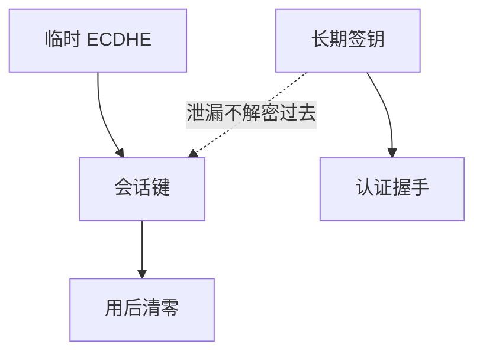

# 前向保密

长期私钥将来泄漏，也不该能解开过去的会话。做法是每次用临时 DH，会话键用完即忘；静态 RSA 封装做不到这一点。

<footer>—— Diffie, van Oorschot and Wiener, Authentication and Authenticated Key Exchanges, 1992；RFC 8446 对 (EC)DHE 的选择</footer>

## 定位

上一课[密钥管理](/cs/key-management-hsm)保护长期根。缺口是**根仍可能在某天泄漏**（备份、强制、漏洞）。前向保密把历史会话从根的命运里摘出去。主干[DH 与 RSA 分工](/cs/dh-vs-rsa)已点名；本课升为主题。

后课默认已经读完本课钉下的合同，只补差，不从该领域第一性原理重开。

## 问题

静态 RSA 封装：谁拿到长期 $d$，谁解密所有被封过的 $k$。ECDHE：临时标量丢弃后，长期签钥只能伪造未来，不能回溯旧 AEAD 键。缺口是会话键的遗忘策略：内存、日志、核心转储都不要留下 $k$。

### 0-RTT 会打折

[TLS 1.3 0-RTT](/cs/tls13-0rtt) 用 PSK 提前发数据，有重放与弱前向窗口。可用性与遗忘在此打架。

Diffie–van Oorschot–Wiener 的认证密钥交换讨论 PFS。本课不给「如何从服务器抠过去会话」的步骤。

## 方法

对照静态封装 vs 临时 DH。要求：临时密钥在握手后清零；长期钥只做签名或认证。指出记录层序号防重放，但不等于 PFS。

图中节点是本课的机制骨架；课程不把图展开成可运行的攻击步骤。

## 机制

HSM 里的长期钥仍值得关；PFS 保证关不住的那一天历史仍在计算上保密。Signal 下一课把「多次会话」收成棘轮，使更细粒度的遗忘成为可能。

前提写进合同之后，游戏外的误用只当失败模式点名，不在本课写成操作程序。

## 边界

本课不把后量子 KEM 提前展开。双棘轮下一课：每条消息都可以进一格，前向与后向保密的工程形态。

## 小结

- HSM 护根；PFS 让根的未来泄漏不回溯。
- 临时 DH + 遗忘会话键；静态 RSA 封装无此性质。
- 0-RTT 与日志里的 $k$ 会削弱遗忘。
- 下一课 Signal 双棘轮。
- 出处：Diffie, van Oorschot and Wiener, 1992；RFC 8446。
