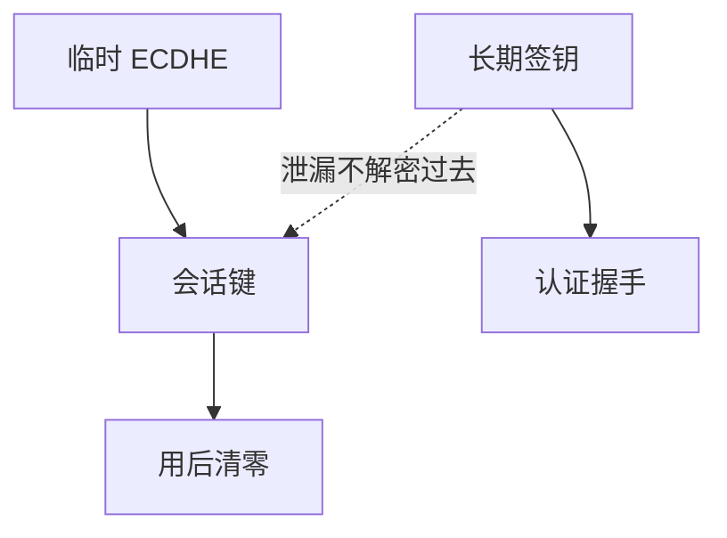
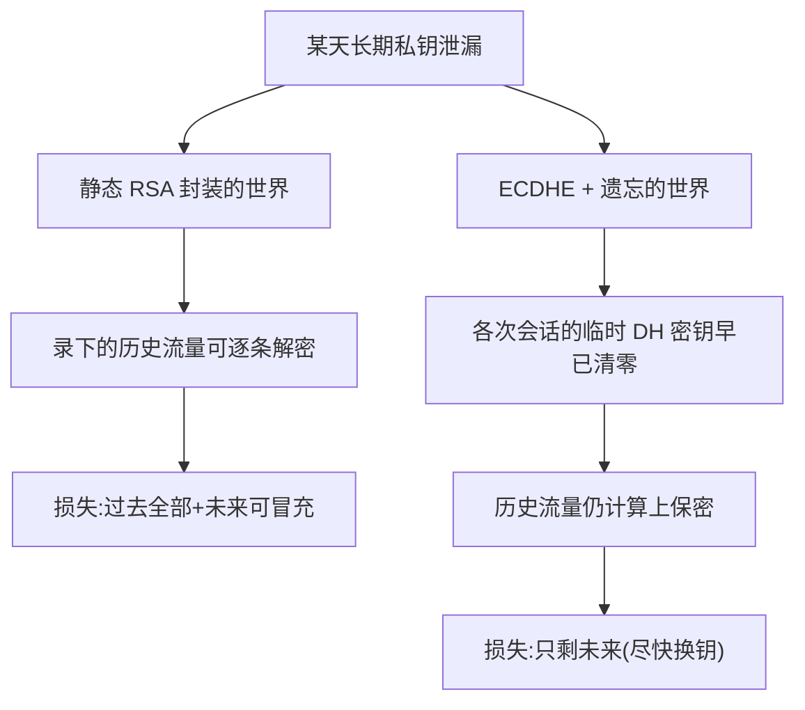

# 前向保密

长期私钥将来泄漏，也不该能解开过去的会话。做法是每次用临时 DH，会话键用完即忘；静态 RSA 封装做不到这一点。

<footer>—— Diffie, van Oorschot and Wiener, Authentication and Authenticated Key Exchanges, 1992；RFC 8446 对 (EC)DHE 的选择</footer>

上一课[密钥管理](/cs/key-management-hsm)保护长期根。缺口是**根仍可能在某天泄漏**（备份、强制、漏洞）。前向保密把历史会话从根的命运里摘出去。主干[DH 与 RSA 分工](/cs/dh-vs-rsa)已点名；本课升为主题。

后课默认已经读完本课钉下的合同，只补差，不从该领域第一性原理重开。

## 问题

静态 RSA 封装：谁拿到长期 $d$，谁解密所有被封过的 $k$。ECDHE：临时标量丢弃后，长期签钥只能伪造未来，不能回溯旧 AEAD 键。缺口是会话键的遗忘策略：内存、日志、核心转储都不要留下 $k$。

直觉类比：前向保密像每次谈话都临时约定一套一次性暗号，谈完立刻烧掉；日后哪怕有人偷走你的「母本」长期钥，也复原不了已经烧掉的暗号。静态 RSA 封装则像所有信件都用同一把锁——钥匙一丢，历史信件全部可读。

### 0-RTT 会打折

[TLS 1.3 0-RTT](/cs/tls13-0rtt) 用 PSK 提前发数据，有重放与弱前向窗口。可用性与遗忘在此打架。

初学者容易以为「TLS 1.3 强制 PFS，所以 0-RTT 里的数据也享受完整前向保密」。实际上 0-RTT 数据由 PSK 派生，不在 ECDHE 的临时性保护里，攻击者还可以在重放窗口内把你首批请求原样重发——比如让「下单」被执行两次。

Diffie–van Oorschot–Wiener 的认证密钥交换讨论 PFS。本课不给「如何从服务器抠过去会话」的步骤。

## 方法

对照静态封装 vs 临时 DH。要求：临时密钥在握手后清零；长期钥只做签名或认证。指出记录层序号防重放，但不等于 PFS。

```mermaid
flowchart TD
  EPHEM["临时 ECDHE"] --> SK["会话键"]
  SK --> FORGET["用后清零"]
  LONG["长期签钥"] --> AUTH["认证握手"]
  LONG -.->|"泄漏不解密过去"| SK
```

## 机制

HSM 里的长期钥仍值得关；PFS 保证关不住的那一天历史仍在计算上保密。Signal 下一课把「多次会话」收成棘轮，使更细粒度的遗忘成为可能。

为什么这一性质在今天格外重要：对手可以「先抓储、后解密」——今天把你的全部 TLS 流量原样录下来存着，等哪天拿到长期钥（漏洞、传票、内部人员）再翻旧账。有 PFS 时，「等」变得毫无意义，录下的密文永远是密文。

```mermaid
flowchart TD
  L["某天长期私钥泄漏"] --> A["静态 RSA 封装的世界"]
  L --> B["ECDHE + 遗忘的世界"]
  A --> A1["录下的历史流量可逐条解密"]
  A1 --> A2["损失:过去全部+未来可冒充"]
  B --> B1["各次会话的临时 DH 密钥早已清零"]
  B1 --> B2["历史流量仍计算上保密"]
  B2 --> B3["损失:只剩未来(尽快换钥)"]
```

## 边界

本课不把后量子 KEM 提前展开。双棘轮下一课：每条消息都可以进一格，前向与后向保密的工程形态。

## 小结

- HSM 护根；PFS 让根的未来泄漏不回溯。
- 临时 DH + 遗忘会话键；静态 RSA 封装无此性质。
- 0-RTT 与日志里的 $k$ 会削弱遗忘。
- 下一课 Signal 双棘轮。
- 出处：Diffie, van Oorschot and Wiener, 1992；RFC 8446。
