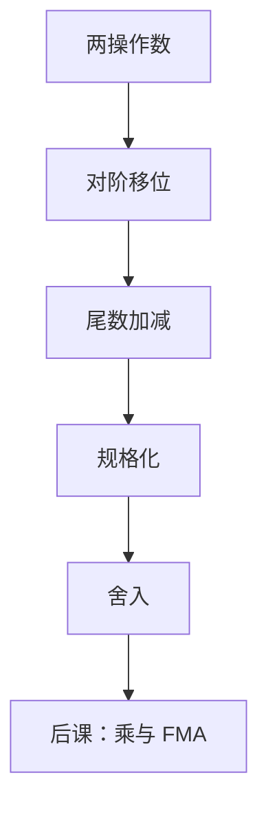

# 浮点加法器

  
对阶把小数点对齐，相加之后可能要右移一位或左移许多位；路径深度来自移位与前导零，而不是再造一种 IEEE 位型。

  <footer>—— 据 IEEE Std 754-2008；Harris and Harris, Digital Design and Computer Architecture；Patterson and Hennessy, Computer Organization and Design (RISC-V) 整理</footer>

[上一课](/cs/newton-division)把除收成迭代乘，并预告浮点还要对阶与舍入。[IEEE 754](/cs/ieee-754) 与[舍入模式](/cs/rounding-modes)已钉位型和往哪边靠。缺口是电路：**两个规格化数相加**要经过哪几级组合（或流水），整数 [CLA](/cs/adder-cla) 只出现在尾数对齐之后。

## 问题

$(\pm m_1 2^{e_1})+(\pm m_2 2^{e_2})$。先比较指数，把较小的尾数右移 $|e_1-e_2|$ 位（对阶），再按符号决定尾数加或减。和可能 $\in[1,4)$ 或对消到远小于 1。缺口不是再解释隐藏位，而是数据通路：指数差 → 移位器 → 尾数加减 → 规格化移位 → 舍入。近路径（指数接近、有效减法）与远路径（指数差大或有效加法）可以拆成两条以切延迟——本课点名，不把每级流水线寄存器画完。

### 对阶不是「先都变成定点再加」

右移丢掉的位要进 sticky/guard/round，否则[舍入](/cs/rounding-modes)少信息。把浮点加当成「转定点、整数加、再转回」，会丢掉 GRS 位，也无法处理指数溢出到无穷。非规格化操作数把隐藏位改成 0，移位规则不同，本课承认，细节留给[前导零](/cs/lzc-normalize)。

Patterson/Hennessy 用对阶–加–规格化三框图教学。Harris 把移位器与加法器画实。754 的加法是格式上的正确舍入运算，硬件路径必须保留舍入所需的额外比特。

## 方法

1. 指数比较与差。2. 对齐移位（桶形移位 + sticky OR）。3. 有效加/减（[CLA](/cs/adder-cla)）。4. 若最高位进位则右规 1 位并指数加 1；若前导零则左规。5. 按模式舍入，可能再进位导致二次规格化。符号：有效减时由幅度大的那个决定。

指数全 1 / 全 0 的特殊值走旁路：NaN 传播、无穷规则，下一课异常旗标再钉检测点。

## 机制

后课 FMA 把「乘完再加」熔成一次舍入，加法器会多吃一个乘积宽度的对齐。本课的独立加法器仍是 ABI 里 `fadd` 的语义核。流水线切在移位与加法之间，是微结构，不改变 754 函数。

## 边界

本课不实现十进制 754，不把 SIMD 打包浮点加写成向量通路——那是后课 ISA 对照。也不把「训练用的混合精度加法」写进组成；本栏是比特到系统。

后课默认：浮点加 = 对阶 + 尾数加减 + 规格化 + 舍入；整数 CLA 只作用于对齐后的尾数。

## 小结

- 位型已在 754；本课是加法数据通路。
- 对阶移位保留 GRS；规格化处理进位与对消。
- 近/远路径是延迟切分，不是两种语义。
- 出处：IEEE 754-2008；Harris and Harris；Patterson and Hennessy, COD (RISC-V)。
