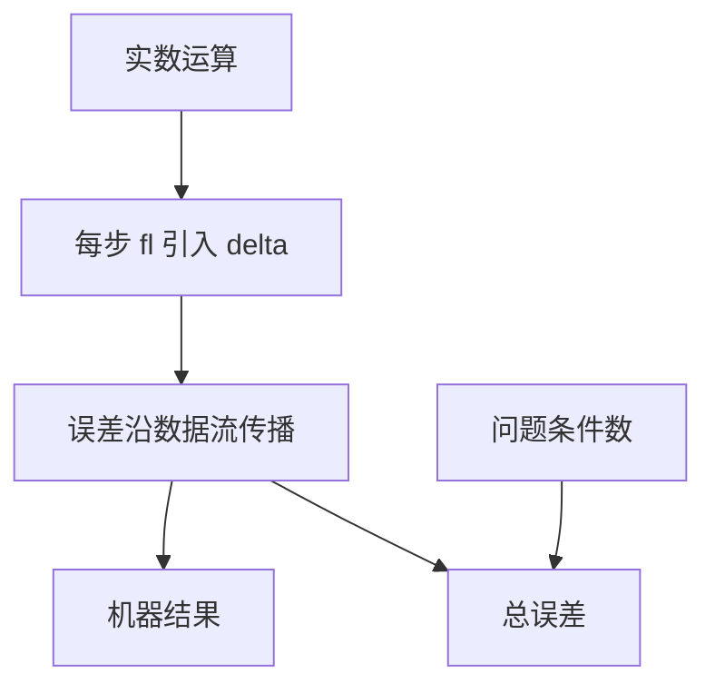

# 舍入误差如何传播

每次浮点运算把精确结果再映回有限集合；分析算法时要把这次映回写成乘在结果上的 $(1+\delta)$，而不是假装在实数域演算。

<footer>—— 据 Higham, Accuracy and Stability of Numerical Algorithms；Golub and Van Loan, Matrix Computations 整理</footer>

上一课[条件概率与贝叶斯](/cs/conditional-bayes)收束信息与离散主干：有限对象上的条件与反转已经钉死。[IEEE 754](/cs/ieee-754) 已经给出位型、偏置指数与默认舍入。本课是「数值计算」第一课；后课默认已经读完本课。不重讲概率，也不从符号位、尾数宽度另起。缺口是：格式已经固定，**一步舍入怎样写进代数、多步之后误差项如何长到终点**。问题本身有多敏感，交给[条件数](/cs/condition-number)。

## 问题

实数 $x$ 在机器上变成 $\mathrm{fl}(x)=x(1+\varepsilon)$，$|\varepsilon|\le u$，其中 $u$ 是舍入单位。算术运算 $\circ$ 的模型是 $\mathrm{fl}(a\circ b)=(a\circ b)(1+\delta)$，$|\delta|\le u$（在不溢出的前提下）。缺口因此不是「浮点不精确」的口号，而是**可传递的误差代数**：把每一步的 $\delta$ 乘进后续运算，得到对终点的界。没有这套记号，后课稳定与消去只会剩下一堆反例。

信息课已经说明 NaN 与无穷是编码；本课假定运算落在规格化有限数上，例外与非规格化不在此展开。贝叶斯课的「误差」是概率质量；这里的误差是舍入引入的相对扰动，对象不同。

### 传播不是条件数

条件数问：数据里已有的扰动被问题放大多少。本课问：算法在机器上每步新注入多少舍入。总误差大致是「问题放大 × 算法注入」。把二者都叫做「数值不稳定」，后课无法分工：病态问题即使用精确算术也会大变；不稳定算法则在良态问题上也会毁掉位数。

Higham 用 $\mathrm{fl}$ 与 $\gamma_n$ 把舍入写成可计算的乘性扰动。Golub and Van Loan 把同一套用在矩阵乘与分解。Wilkinson 的早期浮点误差代数是源头，本课按 Higham 的记号走。

## 方法

记 $\gamma_n=nu/(1-nu)$（当 $nu\lt 1$）。$n$ 次乘加的朴素界用 $\gamma_n$ 吸收「每次一个 $u$ 再相乘」的高阶项。标量求和 $\hat s=\mathrm{fl}(x_1+\cdots+x_n)$ 满足 $|\hat s-s|\le \gamma_{n-1}\sum|x_i|$ 量级。内积、矩阵乘把同一计数换成「每个输出经过多少次乘加」。

本课只给前向图像：$\hat y-y$。把 $\hat y$ 解释成「某个近旁问题的精确解」是后课后向稳定。求和顺序与补偿算法只点名，算法在[求和顺序](/cs/summation-order)。

## 机制

相对误差在乘法下近似相加（对数量级），在加减下取决于是否相近相消——那是消去课。传播分析的用处是：看出误差如何随运算次数线性或更糟地长，从而知道 $n$ 很大时朴素三重循环不只是慢，界也变宽。FMA 少一次舍入，会改 $\delta$ 的个数，不改 754 位型。后课线性代数把同一 $\gamma_n$ 接到分解与迭代。

相对模型在加减时并不总是忠实：若结果的量级远小于操作数，相对误差相对真值可以爆掉，那是消去课。本课的 $\gamma_n$ 先假定没有这种抵消，给出「普通乘加链」的尺度，用来比较算法：同样 $n$ 次运算，有的把常数藏进 $\gamma_n$，有的把 $n$ 变成 $n^2$。矩阵乘的三种循环顺序在精确算术里相同，在浮点里给出不同的 $E$，但通常仍是同一量级的 $\|E\|\le\gamma_n\|A\|\,\|B\|$。后课条件数把这个 $E$ 当成数据扰动来读，前向误差才有问题这一侧的乘数。

## 边界

本课不重画 IEEE 位域，不讲异常标志。区间算术是另一套工具。后课默认：有限精度运算写成 $(1+\delta)$；复合用 $\gamma_n$ 计量；总误差要与条件数分工。下一课定义条件数。

## 小结

- 舍入写成相对扰动 $\delta$；多步用 $\gamma_n$ 界跟踪。
- 传播描述算法注入；条件数描述问题放大。不重写 754 格式。
- 内积与矩阵乘的误差计数来自乘加次数。
- 出处：Higham；Golub and Van Loan。
