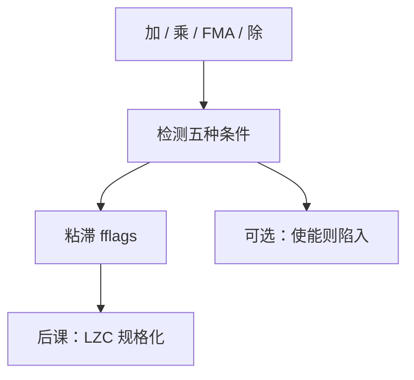

# 浮点异常与标志

  
754 把五种异常钉成状态位：无效、除零、上溢、下溢、不精确；默认常常不陷阱，只记下，让软件事后读。

  <footer>—— 据 IEEE Std 754-2008；Patterson and Hennessy, Computer Organization and Design (RISC-V)；The RISC-V Instruction Set Manual, Volume I 整理</footer>

[上一课](/cs/fp-mul-fma)的乘与 FMA 会在指数两端和不精确格子上「出事」，加法器同样。[IEEE 754](/cs/ieee-754) 把 NaN 与无穷写成位型，还没有说硬件何时置位、软件何时看见。缺口是：**异常检测点与标志寄存器**，不是再解释什么是 NaN。

## 问题

五种标准异常：invalid（无序运算、$\sqrt{-}$、0/0 等）、division by zero（有限/0 得无穷）、overflow、underflow、inexact。默认响应是递送结果（无穷、NaN、最大有限数或非规格化）并置 sticky 标志。缺口不是新的算术，而是：ALU 各路径上的比较器与指数饱和逻辑要接到一组 **accrued flags**，通常不自动陷入。

RISC-V `fflags` CSR 就是这五位；`frm` 是[舍入模式](/cs/rounding-modes)。本课不把 `mtvec` 陷阱入口重讲一遍，只承认「若使能陷阱则改走异常入口」。

### 标志不是「errno」

它们是粘滞位：一次不精确会一直留到软件清。语言级的 `errno` 或异常对象是另一层。把每次 `fadd` 当系统调用错误码，流水线无法把标志接到 CSR 写口。NaN 载荷与 quiet/signaling 决定 invalid 是否在比较时触发——位型课已分无穷与 NaN，本课只接线。

754-2008 §7 规定异常。RISC-V 用户手册把 `fflags` 列为浮点 CSR。Patterson/Hennessy 教学常省略标志，本补层补上，因为后课定点 DSP 的饱和是另一套「出错」哲学。

## 方法

在规格化与舍入之后采样：指数超过最大值 → overflow（常同时 inexact）；结果非零且指数低于最小值 → underflow（与 tininess 检测时机有关，本课点名不背条款号）；GRS 非零 → inexact；操作数是 sNaN 或无效组合 → invalid；除零规则独立。FMA 只产生一组标志，对应那一次舍入。

软件：读标志做区间诊断或调试；数值库很少每条指令清一次。

## 机制

下两课前导零计数是规格化硬件，也影响 underflow（左规后是否仍低于最小指数）。定点溢出检测是整数旗标，不要与这五位混进同一个 CSR。后课 HDL 实现时，这些位是流水线写回的副作用，须与结果同拍提交，否则乱序 FPU 会把后来指令的标志提前粘上——微结构问题，本课只钉语义。

## 边界

本课不写 754 的 alternate exception handling 全部条款，不把 Unix SIGFPE 默认打开。不讨论十进制格式的额外异常。也不把「模型训练里忽略 NaN」写成规范。

后课默认：浮点运算更新五位粘滞标志；默认不陷阱；与整数溢出旗标分家。

## 小结

- 五种 754 异常接到粘滞标志，默认递送结果。
- RISC-V 上是 `fflags`；陷阱是可选使能。
- FMA 对应一次舍入、一组标志。
- 出处：IEEE 754-2008；RISC-V ISA Manual, Vol. I；Patterson and Hennessy, COD (RISC-V)。
