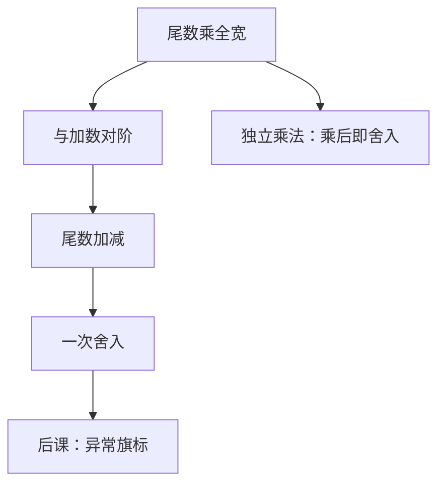

# 浮点乘法与 FMA

  
尾数相乘是无符号阵列，指数相加再减偏置；熔合乘加把乘积以全宽送进加法器，只舍入一次。

  <footer>—— 据 IEEE Std 754-2008；Patterson and Hennessy, Computer Organization and Design (RISC-V)；Hennessy and Patterson, CA:AQA 整理</footer>

[上一课](/cs/fp-adder)钉了对阶–尾数加–规格化。[Booth](/cs/booth-multiplier) 与[华莱士](/cs/wallace-carry-save)已给出整数乘的压缩树。缺口是把它们接进 754：符号 XOR、指数加、尾数乘，以及 2008 年写成基本运算的 **FMA**（fused multiply-add）。

## 问题

规格化数乘：$(\pm m_1 2^{e_1})(\pm m_2 2^{e_2})=\pm (m_1 m_2)2^{e_1+e_2}$。尾数乘积在 $[1,4)$，可能右规 1 位。指数要减偏置，并检测上溢/下溢。缺口不是再讲部分积，而是：**乘积宽度**（`binary32` 为 24×24→48 位）如何进舍入，以及 $a\times b+c$ 若先乘后加会舍入两次，FMA 要求一次。

牛顿除[上一单元](/cs/newton-division)依赖这条乘法器。本课把乘和 FMA 当作同一尾数树的两种收尾。

### FMA 不是「乘加各做一次再省一个寄存器」

语义差在舍入次数：`fma(a,b,c)` 的理想结果是 $ab+c$ 在无限精度下再按模式映回格子，可以与 `fadd(fmul(a,b),c)` 差 1 ulp 或更多。把 FMA 理解成微结构融合（少一次写回），数值库与误差分析会对不齐。754-2008 把 FMA 列为推荐/要求的运算，RISC-V `F`/`D` 有 `fmadd` 等。

Patterson/Hennessy 把浮点乘画成指数加与尾数乘两框。Hennessy/Patterson CA:AQA 讨论 FMA 对点积精度的影响。本课不进入张量核或混合精度训练。

## 方法

尾数：无符号阵列或 Booth+CSA，产出全宽积。指数：整数加，减 bias，再加规格化修正。FMA：全宽积与 $c$ 的尾数对阶（移位量由指数差决定，积的二进制点在中间），走[浮点加法器](/cs/fp-adder)的加减与舍入，但加法器宽度按积来。符号：乘为 XOR；加再按有效加减决定。

独立 `fmul` 在树之后就舍入到目标格式；FMA 跳过这次中间舍入。

## 机制

后课异常旗标要在乘、加、FMA 各路径上采样上溢、下溢、不精确。LZC 规格化对 FMA 的有效减同样关键。定点 DSP 乘加是另一套无指数的饱和通路，再后几课才对照，以免把 MAC 与 FMA 混名。

## 边界

本课不写 GPU 张量核、不重写 Transformer 里的 SDPA。不把十进制 FMA 列入。软浮点用整数乘模拟同一语义，电路不在本课。

后课默认：浮点乘是尾数阵列加指数整数加；FMA 是全宽积再加、一次舍入。

## 小结

- 尾数乘复用整数压缩树；指数加偏置。
- FMA 改变的是舍入次数，不只是吞吐。
- 牛顿除依赖这条乘法器。
- 出处：IEEE 754-2008；Patterson and Hennessy, COD (RISC-V)；Hennessy and Patterson, CA:AQA。
