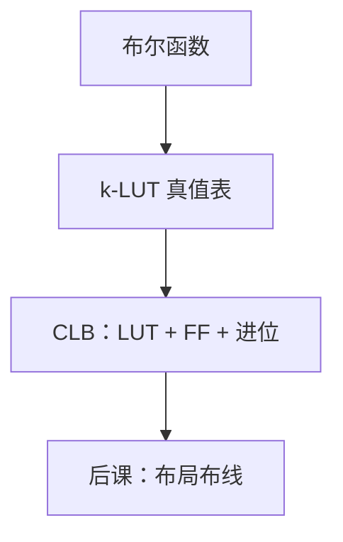

# FPGA LUT 与 CLB

  
查找表用 SRAM 存真值表，任意 $k$ 输入布尔函数一块 LUT 就够；可配置逻辑块再把 LUT、进位链与触发器捆在一起。

  <footer>—— 据 Harris and Harris, Digital Design and Computer Architecture；Kuon, Tessier, Rose, FPGA Architecture: Survey and Challenges, Found. Trends EDA 2008 整理</footer>

[上一课](/cs/async-fifo-cdc)的 FIFO 与算术单元最终要落到某种硅结构上。ASIC 用标准单元库；FPGA 用**可配置**的 LUT 与 CLB（或 LAB）。缺口是：综合网表在 FPGA 上的**基本砖**是什么，而不是再讲综合算法。

## 问题

[PLA](/cs/pla-rom) 用与或阵列；FPGA 主流是 SRAM LUT：6 输入 LUT 存 64 bit 真值表，实现任意 6 输入函数。CLB 含若干 LUT、FF、进位旁路（为加法器准备，对照 [CLA](/cs/adder-cla) 的专用进位）。缺口不是「FPGA 比 ASIC 慢」的口号，而是映射目标：`assign y = a & b` 变成 LUT 初始化值，`posedge` 变成 CLB 里的 FF。

DSP 块、块 RAM 是旁边的硬核，对应上一单元乘加与 FIFO RAM，本课点名，下一课布局才说怎么连。

### LUT 不是「小型处理器」

LUT 计算组合函数，没有程序计数器。把 LUT 理解成在芯片上跑解释器，会与后课 HLS 的「C 变成电路」混层。配置比特在上电时从闪存加载，那是静态结构，不是指令流。

Harris 用 LUT 教 FPGA。Kuon/Tessier/Rose 综述架构。Xilinx/AMD CLB、Intel ALM 细节不同，本课钉 LUT+FF+进位链这一共同形状。

## 方法

综合：布尔映射到 LUT 覆盖（切函数到 $k$ 输入）。打包：若干 LUT/FF 塞进同一 CLB 以共用布线口。进位链：专用连线实现快加，比用普通 LUT 进位短。配置 SRAM 易失，故需外部比特流——后课不必展开加载协议。

异步 FIFO 的双口 RAM 优先映射到块 RAM，而不是 LUT RAM，除非深度很小。

## 机制

下一课布局布线把 CLB 放到二维阵列并连接开关盒。STA 用 FPGA 的延迟表，时钟用全局网络（对照 [CTS](/cs/clock-skew-cts)）。ASIC 标准单元课会对照：LUT 灵活、延迟与功耗通常差于硬连线标准单元。

## 边界

本课不背某代 LUT 输入数，不把 eFPGA 嵌入式阵列写进主干。不讲光刻如何造 SRAM LUT。不把 FPGA 当「AI 加速器品牌」介绍。

后课默认：FPGA 组合逻辑的原子是 LUT，时序原子是 CLB 内 FF；硬核旁路乘加与 RAM。

## 小结

- FPGA 用 LUT 存真值表，CLB 捆 LUT、FF、进位链。
- 综合映射到 LUT 覆盖，不是映射到 ASIC 标准单元。
- 下一课在阵列上放置这些块并布线。
- 出处：Harris and Harris；Kuon, Tessier, Rose, 2008。
