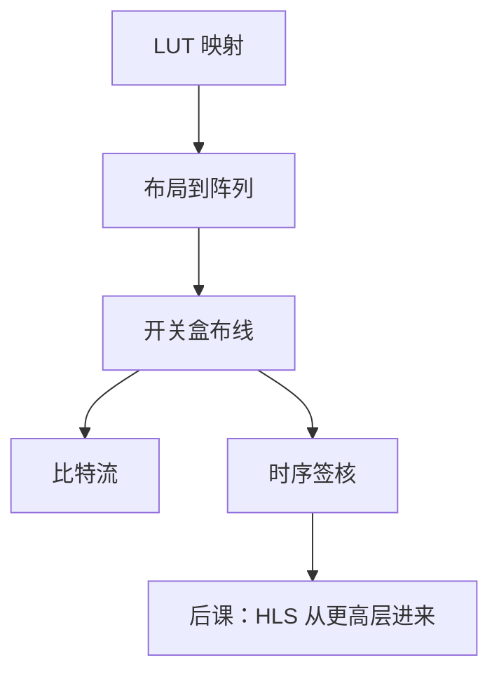

# FPGA 布局布线

  
逻辑映射之后仍不知道哪一列 CLB 被占用、哪一段开关盒接通；布局布线决定线延迟，从而改写 STA 的 slack。

  <footer>—— 据 Harris and Harris, Digital Design and Computer Architecture；Betz, Rose, Marquardt, Architecture and CAD for Deep-Submicron FPGAs 整理</footer>

[上一课](/cs/fpga-lut-clb)给出 LUT/CLB 砖块。综合网表仍是逻辑连接。缺口是 **place and route**：把实例放到二维阵列，再在布线通道里接通，得到可下载的比特流与真实延迟。

## 问题

FPGA 布线是预制的分段导线加开关晶体管，不是 ASIC 那样任意金属形状（ASIC 流程后课再讲）。布局：邻近的 CLB 应放近，DSP/BRAM 是稀疏硬核，算术单元的乘法器必须「靠」DSP 列。布线失败（不可布）或延迟过大导致[STA](/cs/sta) 负 slack。缺口不是再解释 LUT，而是这层物理对应。

时序驱动布局用 STA 的关键网加权。时钟用专用全局/区域网络，普通信号不要抢时钟树。

### 比特流不是「网表的压缩包」

比特流编码的是 SRAM LUT 初值与开关盒通断，格式专有。把 `.bit` 当另一份 Verilog 阅读，逆向与安全是另一课；本课只承认：功能与时序在 P&R 之后才封闭。

Betz/Rose 的 VPR 教材是 FPGA CAD 经典。Harris 描述设计流程：综合→映射→布局→布线→时序。本课不教某 IDE 的点击顺序。

## 方法

1. 映射已在上一课。2. 打包 CLB。3. 布局最小化线长与时序代价。4. 布线分配通道；拥塞则绕路，延迟上升。5. 静态时序签核；失败则改 RTL、约束或再优化。引脚锁定影响边缘延迟。

跨时钟 FIFO 的两时钟必须各接到合法时钟网络，否则工具用普通布线走时钟，skew 不可控。

## 机制

后课 HLS 仍然经过同一 P&R；只是 RTL 由工具生成。ASIC 布局布线没有开关盒，但「时序闭合」同一目标。本课把 FPGA 的物理闭环钉死，让后面的功耗与验证知道延迟来自布线，不是来自 `#delay`。

## 边界

本课不讨论部分重配置的全部安全模型，不把 PCB 走线当 FPGA 内部布线。不进入光刻分辨率与金属层——FPGA 对用户是已造好的阵列。

后课默认：FPGA 时序在布局布线后才真实；DSP/BRAM 位置是一等约束。

## 小结

- LUT 映射之后还要放置 CLB 并接通开关盒。
- 线延迟进入 STA；时钟走专用网络。
- 比特流是配置 SRAM，不是可读网表。
- 出处：Harris and Harris；Betz, Rose, Marquardt。
