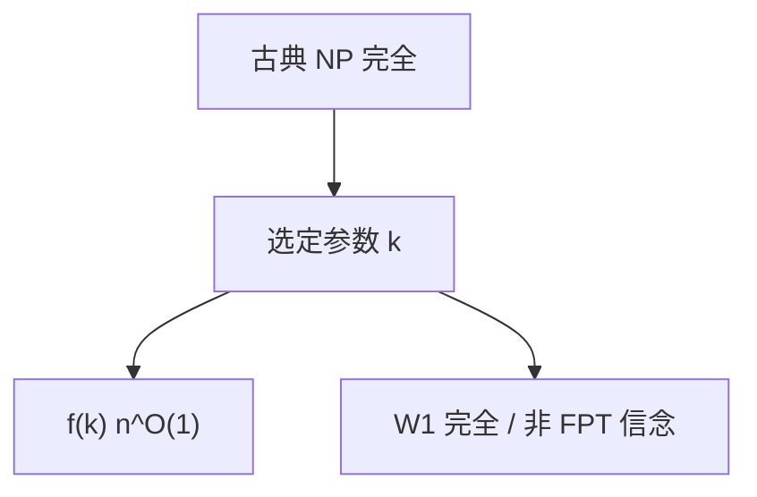

# 参数化复杂性 FPT

把参数 $k$ 从输入长度 $n$ 里拆出来：$f(k)n^{O(1)}$ 为 FPT；若必须 $n^{g(k)}$，则停在 XP 或 W 层级，顶点覆盖与团因此分家。

<footer>—— 据 Downey and Fellows, Parameterized Complexity；Cygan et al., Parameterized Algorithms 整理</footer>

上一课[电路](/cs/circuit-complexity) 仍对 $n$ 最坏。主干 NPC 把顶点覆盖与团捆在一起。缺口是**参数**：覆盖大小 $k$ 小时，覆盖有 $1.28^k n$ 一类算法，团没有已知的 $n^{o(k)}$。FPT vs W[1]。

## 问题

参数化问题 $(x,k)$。FPT：时间 $f(k)|x|^{O(1)}$，$f$ 任意可计算（通常指数）。核：多项式时间压到 $g(k)$ 规模，再蛮力。顶点覆盖：搜两边或核 $2k$。团、独立集对参数解大小是 W[1] 完全：相信不在 FPT。W 层级用短路电路或权 $k$ 的 SAT 切片定义，本课要形状不写完全性证明。

XP：$n^{g(k)}$，包含 FPT。FPT $\neq$ XP 若时间层级一类假设。ETH（指数时间假设）把 $2^{o(n)}$ 的 3SAT 排除，用来钉 FPT 的 $f(k)$ 底。

### 不是「$k$ 很小就多项式」

$n^k$ 当 $k=\log n$ 已超多项式。FPT 要求 $n$ 的指数与 $k$ 无关。把 $k$ 取成 $n$ 就退回古典。

Downey–Fellows 开创。Cygan 等是算法书。本课不把树宽算法写完，点名：树宽 $w$ 时许多问题 $2^{O(w)}n$。

## 方法

对顶点覆盖给搜树或核的思路。对团说明为何蛮力 $n^k$ 停在 XP。声明：同一古典 NPC 问题，换参数（解大小、树宽、删除数）可进 FPT 或 W 难。不要对所有 NPC 宣称「参数化之后就好」。

## 机制

FPT 把组合爆炸关进 $k$。实践：编译、生物网络里 $k$ 真小才有意义。W[1] 完全是参数世界的 SAT。与近似、随机正交：一个问题可以 FPT 但不可近似，或反之。

核大小下界（多项式核是否存在）是另一层，本课点名。

核是 FPT 的证书：压到 $g(k)$ 再 $2^{g(k)}$ 蛮力仍 FPT。多项式核是否存在另有下界技术（或门）。树宽 $w$ 时，许多 MSO 性质 $f(w)n$，Courcelle，点名。把 $k$ 取成解大小，顶点覆盖与团分家——同一 NPC 标签，参数化后不是一类。

## 边界

本课不证 W[1] 完全，不引入 MSO / Courcelle 全文。不把机器学习的超参当 $k$。后课默认：谈「$k$ 小时」，先问 FPT 还是 $n^k$。下一课平均情形与单向函数。

FPT 要求 $n$ 的指数与 $k$ 脱钩；$n^k$ 停在 XP。ETH 用来钉 $f(k)$ 不能再降到 $2^{o(k)}$ 一类。同一古典 NPC 问题换参数（树宽 vs 解大小）可进 FPT 或 W 难。

上一课留下的缺口在本课收口；「参数化复杂性 FPT」进入后课词汇表后只引用。文献用来钉对象与边界，不把本课写成该主题的独立综述。

## 小结

- FPT $= f(k)n^{O(1)}$；顶点覆盖典型，团对解大小不是。
- W[1] 是参数化硬度；ETH 钉 $f(k)$ 底。
- 参数选择决定类，不是问题名字决定。
- 出处：Downey and Fellows；Cygan et al.。
