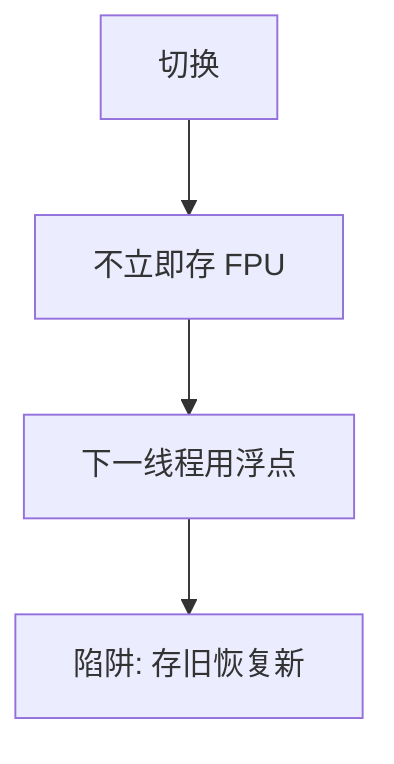

# FPU 惰性保存

大多数线程切换并不碰到浮点寄存器；等到下一次真正用 FPU 再保存上一所有者，比每次切换都搬几百字节更便宜。

<footer>—— 据 Love, Linux Kernel Development；Tanenbaum MOS 对上下文切换代价的整理</footer>

[上一课](/cs/kernel-stack)让通用寄存器与 trapframe 跟着内核栈走。向量与浮点寄存器组很大，每次[上下文切换](/cs/context-switch)都保存会抬高切换税，而大量内核路径与整数进程根本不用它们。缺口是**惰性保存**：记住 FPU 的当前所有者，切走时只设「下一线程使用则陷阱」，直到陷阱才把状态写入上一任务的 PCB。

## 问题

若每次切换都存还原 FPU，[调度指标](/cs/scheduling-metrics)里的吞吐被无谓搬运压住。若永不保存，两个用浮点的线程会互相覆盖。惰性：切换时关 FPU（或标脏），下一线程执行浮点指令则陷入内核，此时保存旧所有者、恢复新线程的 FPU 镜像、标记新所有者。缺口不是更大的内核栈，而是这条延迟到第一次使用才付的账。

内核本身少用浮点；一旦内核用了，必须急切保存用户 FPU 或禁止在该路径抢占，以免污染。

## 方法

PCB 里有 FPU 保存区与「内容是否有效」位。硬件：TS 一类标志使浮点指令陷阱。陷阱处理：存旧、恢复新、清标志、从陷阱返回重执行该指令。两个都不用 FPU 的线程之间，切换不碰 FPU 寄存器。

信号递送若要给处理函数一个干净的浮点环境，可能被迫提前保存——点到即可，不写 ABI 全文。

## 机制

惰性把切换代价变成「用 FPU 的线程才付」。与 trapframe 的急切保存对照：通用寄存器每次陷入都可能被内核当临时量，必须当场存；FPU 内核通常碰不到。多核上每 CPU 记住所有者；迁移时要把所有权弄对，否则会恢复错核上的寄存器。本课不把 xsave 优化路径写完。

## 边界

本课不列举 AVX-512 状态组件的大小表，不讨论如何用浮点陷阱做侧信道。用户是否「应该」在信号处理里用浮点是 ABI 问题。idle 还没出场：没有可运行任务时 CPU 跑谁，下一课。

后课默认：FPU 可以惰性换。就绪队列空时仍要有一条可运行的内核线程，下一课讲 idle。

## 小结

- FPU/向量很大；切换时惰性，用到再换。
- 通用寄存器仍随 trapframe 急切保存。
- 无任务可跑时的 idle 线程是下一课。
- 出处：Love, *LKD*；Tanenbaum and Bos, *MOS*。
