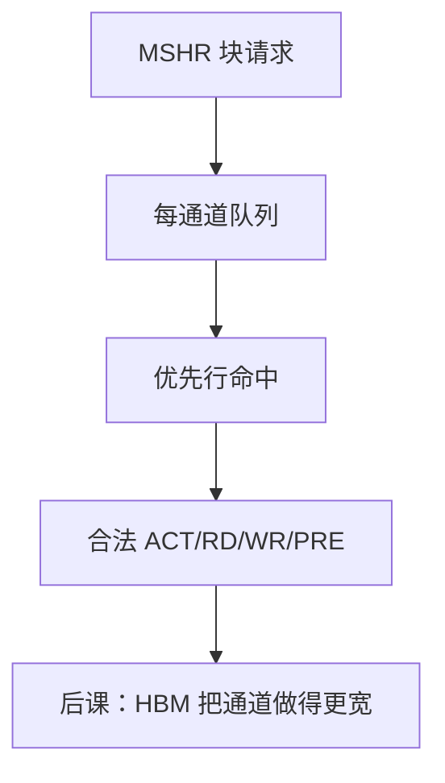

# 内存控制器调度 FR-FCFS

  
先到先服务会把行缓冲打成颠簸；先服务能命中当前行的请求，再按到达序，吞吐上去，公平性要另外补。

  <footer>—— 据 Rixner et al., Memory Access Scheduling, ISCA 2000；Hennessy and Patterson, CA:AQA 整理</footer>

[上一课](/cs/address-interleaving)决定了哪些请求碰巧同行。[行缓冲](/cs/row-buffer-bank-conflict)给出命中价值。缺口是 **调度策略**：控制器队列里选下一条合法 [DDR 命令](/cs/ddr-protocol)。FR-FCFS（first-ready, first-come first-serve）是教材与工业的基线。

## 问题

FCFS：按到达发，无视行状态，冲突与刷新插入使带宽低。FR-FCFS：在时序允许的命令里，优先选行命中（ready），同档再按到达。缺口不是再切片地址，而是队列仲裁：读优先于写（避免 load 等写突发）、写排水阈值、刷新窗口抢占。

多核：一个核的流式访问可长期占住打开行，饿死延迟敏感核——公平性扩展（PAR-BS 等）点名，本课不展开论文竞赛。

### FR-FCFS 不是 CPU 的 Tomasulo

它调度的是 DRAM 命令，不是指令窗口的广播。MSHR 已把 cache 缺失变成块请求；控制器再把块拆成命令。把二者合成「乱序内存」，一致性模型会与 ROB 提交搅在一起。

Rixner et al., *ISCA* 2000 提出/普及内存访问调度与 FR-FCFS 名称。CA:AQA 收成分级存储系统。本课不发明后续 arXiv 调度器。

## 方法

每通道队列。合法命令集由每 bank 计时器过滤。优先：刷新到期 > 行命中读 > 行命中写（若写水位高则写优先）> 行缺失按 FCFS。关闭页：命中优先项变少，调度更简单、平均冲突代价不同。

与 NUMA：远程请求进另一控制器的同一类调度器，多一跳互连。

## 机制

映射改变同行概率，从而改变 FR-FCFS 的收益。QoS 计数器可限制某源的命中连击。后课持久内存的调度还要考虑写延迟不对称。本课钉 DRAM 基线。

## 边界

本课不把 GPU 内存控制器的波前调度写完，不讨论侧信道（调度时序泄密）。不进入 LOB 撮合队列——名字里的 scheduling 不是交易所。

后课默认：控制器用 FR-FCFS 一类策略在合法命令中挑行命中；公平性是附加约束。

## 小结

- FCFS 无视行缓冲；FR-FCFS 先 ready 命中再到达序。
- 读写优先级与刷新插入是同一仲裁器的一部分。
- 吞吐与公平折中；不是 CPU 乱序内核。
- 出处：Rixner et al., ISCA 2000；Hennessy and Patterson, CA:AQA。
