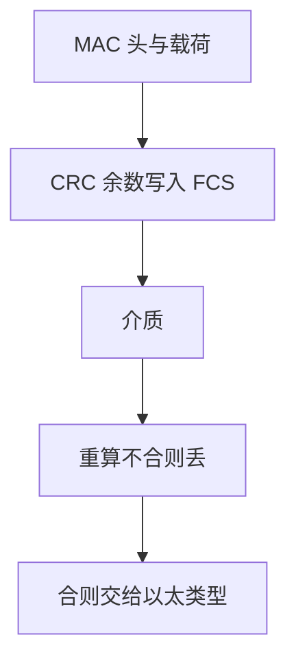

# CRC 在帧上

帧尾的校验序列是这一跳的多项式余数；它发现比特翻转，不证明端到端文件完好。

<footer>—— 据 Peterson and Brown 对 CRC；IEEE 802.3 FCS；Kurose and Ross 整理</footer>

[上一课](/cs/frame-mac)给出帧：MAC、类型、载荷、FCS。本课不重画以太网头。缺口是 FCS 如何从比特串算出、错了谁丢帧，以及它和[端到端](/cs/layering-e2e)校验为何必须并存。[纠错码直觉](/cs/error-correcting-intuition)已在信息论课出现过；这里只把它接到链路上的 CRC。

## 问题

介质噪声会翻比特。若只靠上层发现，一跳上的坏帧仍会占用邻机与交换机。链路把循环冗余校验（CRC）做成帧的一部分：把载荷当多项式，除以约定生成多项式，余数写入 FCS。接收方重算，不合则丢。缺口不是新的 MAC 地址，而是**这一跳的检错合同**。

CRC 擅长短突发错误。它通常只检不纠：纠需要更多冗余与更复杂的接收机，以太网选择丢帧让上层重传。

## 方法

发送前对覆盖范围（头+载荷，具体标准写明）做 CRC，附加 FCS。接收方用同一多项式；余数非约定值则丢，不把坏载荷交给 [IP](/cs/ip-subnet)。交换机存储转发时常验 FCS 再出门；直通交换可能转发已坏的帧，这是延迟与检错的取舍，本课不把直通当默认。

## 机制

CRC 把「这一跳尽力」写成可执行的过滤：网卡与交换芯片在 [DMA](/cs/io-dma) 之前就能拒收。端到端论证仍然成立：中间节点内存、路由软件、磁盘都在 FCS 覆盖之外；文件传送仍要两端核对。传输层校验和（后课 UDP/TCP）覆盖的是伪首部与载荷，对象不是同一跳的电信号。

## 边界

本课不把生成多项式的本原性证明写进主干，不引入以太网之外全部 FCS 宽度。也不把 CRC 当成抗恶意篡改：未认证的多项式余数挡不住有意改帧。完整性作为安全性质是后课 MAC/AEAD 的缺口。

共享介质上两台同时发，FCS 几乎必错——那是冲突，下一课 CSMA，不是「再换一个多项式」。

后课默认：坏帧在链路上被丢掉。多台如何抢介质、交换机如何缩小冲突域，下一课。

## 小结

- FCS 是一跳 CRC：发现翻转，默认丢帧。
- 代替不了端到端校验，也不是认证。
- 冲突与交换是下一课。
- 出处：IEEE 802.3；Kurose and Ross；对照 Peterson 对 CRC 的经典表述。
