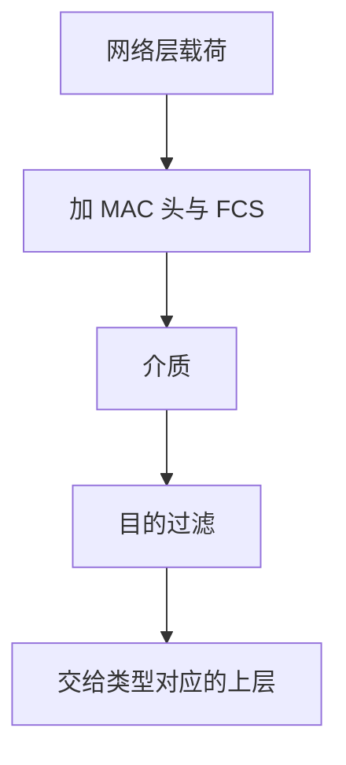

# 帧与 MAC

链路上传送的是帧：目的与源的硬件地址、类型、载荷与校验；MAC 决定谁在何时占用介质。

<footer>—— 据 Metcalfe and Boggs, Ethernet: Distributed Packet Switching for Local Computer Networks, CACM 1976；IEEE 802 整理</footer>

[上一课](/cs/five-vs-four-layer)给出分层与端到端，还没有一跳的 PDU。[I/O 与 DMA](/cs/io-dma) 能把网卡缓冲搬进内存，但缓冲里的位如何被邻机认成「给我的」。缺口是**帧**与 **MAC 地址**：链路层的名字，只在这一跳有效。

## 问题

广播介质上，所有网卡都可能看见电信号。若没有目的地址，每台主机都要把噪声当数据。以太网风格：48 位 MAC、帧头、载荷（后课的 IP 包放这里）、FCS。网卡用 DMA 收齐一帧，用地址过滤：不是自己且不是广播/组播则丢。缺口不是 IP 路由，而是这一跳的命名与成帧。

本课不把 CSMA 退避算法写完，那是下一课。

MAC 地址由厂商与全局/本地位组成，链路层当扁平标识用。它不是地理位置，也不能代替 IP 的跨网编号。

## 方法

发送：上层交出载荷，驱动加上目的/源 MAC 与以太类型，算 FCS，经 DMA 出门。接收：FCS 错则丢（链路努力，不是端到端保证）；类型字段交给 IP 或其他。点到点链路（PPP）帧格式不同，对象仍是「一跳 PDU + 校验」。

## 机制

帧把「邻机」从物理连通变成可寻址。交换机（下一课）正是学这些地址来转发；路由器则剥到 IP 再决定下一跳，可能换一个全新的 MAC。端到端论证：FCS 只覆盖这一跳，中间任何存储转发节点之后仍要上层校验。

与进程无关：MAC 命名的是接口，不是[文件描述符](/cs/file-bytestream)。进程要等到套接字课才接到传输层端口。

## 边界

本课不把 Wi-Fi 的关联与 802.11 帧都展开，不引入 VLAN 标签的全部 802.1Q 细节。也不把 MAC 随机化隐私策略写成安全课。冲突如何在共享介质上检测与退避，下一课 CSMA；如何在交换式全双工里消失，也在下一课。

巨帧与标准 MTU 是接口配置；IP 层的 MTU 发现依赖链路实际能装多少载荷。本课不把巨型帧当默认。

后课默认：一跳靠 MAC 与帧。共享总线如何避免同时发送，以及交换如何学地址，下一课。

## 小结

- 帧是链路 PDU；MAC 是接口的扁平地址。
- FCS 是一跳努力，代替不了端到端。
- 冲突与交换是下一课。
- 出处：Metcalfe and Boggs, *CACM* 1976；IEEE 802.3；Kurose and Ross。
