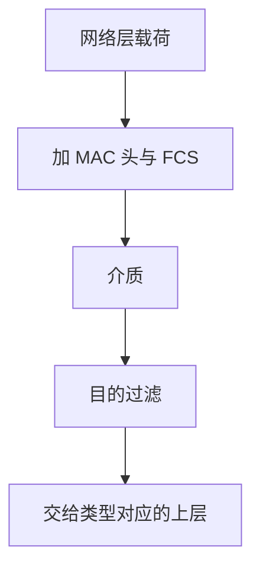
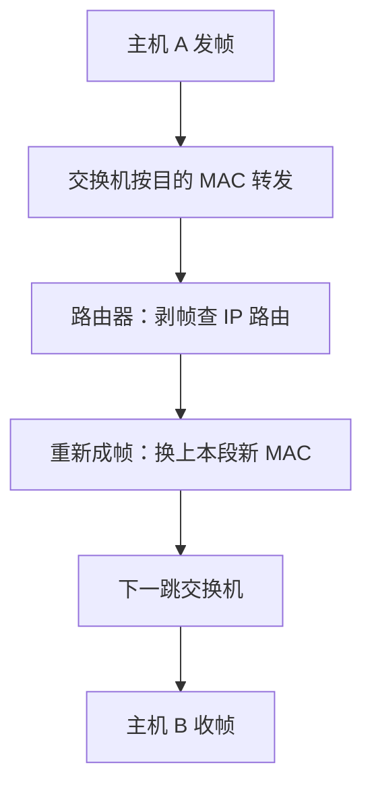

# 帧与 MAC

链路上传送的是帧：目的与源的硬件地址、类型、载荷与校验；MAC 决定谁在何时占用介质。

<footer>—— 据 Metcalfe and Boggs, Ethernet: Distributed Packet Switching for Local Computer Networks, CACM 1976；IEEE 802 整理</footer>

[上一课](/cs/five-vs-four-layer)给出分层与端到端，还没有一跳的 PDU。[I/O 与 DMA](/cs/io-dma) 能把网卡缓冲搬进内存，但缓冲里的位如何被邻机认成「给我的」。缺口是**帧**与 **MAC 地址**：链路层的名字，只在这一跳有效。

## 问题

广播介质上，所有网卡都可能看见电信号。若没有目的地址，每台主机都要把噪声当数据。以太网风格：48 位 MAC、帧头、载荷（后课的 IP 包放这里）、FCS。网卡用 DMA 收齐一帧，用地址过滤：不是自己且不是广播/组播则丢。缺口不是 IP 路由，而是这一跳的命名与成帧。

可以把它想象成小区门牌与通信地址的关系：MAC 是接口出厂刻好的「门牌号」，只在这栋楼（本跳网段）里被认；包裹要寄到另一个城市，靠的是 IP 这个「通信地址」，而且每过一跳还要换一次门牌。

本课不把 CSMA 退避算法写完，那是后面 [CSMA 与交换](/cs/csma-switch)一课的事。

MAC 地址由厂商与全局/本地位组成，链路层当扁平标识用。它不是地理位置，也不能代替 IP 的跨网编号。

## 方法

发送：上层交出载荷，驱动加上目的/源 MAC 与以太类型，算 FCS，经 DMA 出门。接收：FCS 错则丢（链路努力，不是端到端保证）；类型字段交给 IP 或其他。点到点链路（PPP）帧格式不同，对象仍是「一跳 PDU + 校验」。

以太类型（EtherType）就是帧头里的「下一步交给谁」指示牌：0x0800 表示载荷是 IPv4 包，0x86DD 是 IPv6，0x0806 是 ARP——网卡收齐一帧后照着它把载荷递给对应的上层协议。

```mermaid
flowchart TD
  PAY["网络层载荷"] --> FR["加 MAC 头与 FCS"]
  FR --> WIRE["介质"]
  WIRE --> FILT["目的过滤"]
  FILT --> UP["交给类型对应的上层"]
```

## 机制

帧把「邻机」从物理连通变成可寻址。交换机（后面 CSMA 与交换一课）正是学这些地址来转发；路由器则剥到 IP 再决定下一跳，可能换一个全新的 MAC。端到端论证：FCS 只覆盖这一跳，中间任何存储转发节点之后仍要上层校验。

```mermaid
flowchart TD
  A["主机 A 发帧"] --> SW["交换机按目的 MAC 转发"]
  SW --> RT["路由器：剥帧查 IP 路由"]
  RT --> REW["重新成帧：换上本段新 MAC"]
  REW --> SW2["下一跳交换机"]
  SW2 --> B["主机 B 收帧"]
```

这张图回答「MAC 地址跨网时去哪了」：初学者容易以为两台隔互联网的机器通信时帧头不变——实际上每经过一个路由器，源/目的 MAC 都被换成本段链路上的新值；端到端不变的是 IP 地址，不是 MAC。

与进程无关：MAC 命名的是接口，不是[文件描述符](/cs/file-bytestream)。进程要等到套接字课才接到传输层端口。

## 边界

本课不把 Wi-Fi 的关联与 802.11 帧都展开，不引入 VLAN 标签的全部 802.1Q 细节。也不把 MAC 随机化隐私策略写成安全课。冲突如何在共享介质上检测与退避，以及如何在交换式全双工里消失，都在后面 CSMA 与交换一课。

巨帧与标准 MTU 是接口配置；IP 层的 MTU 发现依赖链路实际能装多少载荷。本课不把巨型帧当默认。

后课默认：一跳靠 MAC 与帧。共享总线如何避免同时发送，以及交换如何学地址，在后面 CSMA 与交换一课。

## 小结

- 帧是链路 PDU；MAC 是接口的扁平地址。
- FCS 是一跳努力，代替不了端到端。
- 冲突与交换在后面 CSMA 与交换一课。
- 出处：Metcalfe and Boggs, *CACM* 1976；IEEE 802.3；Kurose and Ross。
