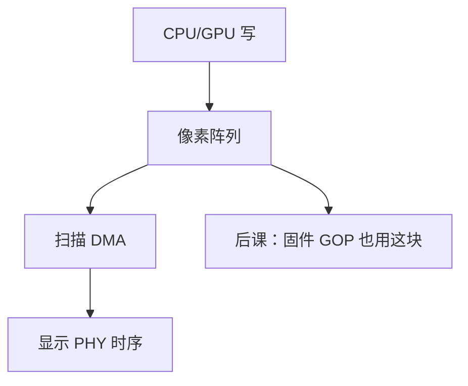

# 显示与帧缓冲

  
扫描输出按行从内存里的像素阵列取数，时序是行/场同步；CPU 写的是这块缓冲，不是每位去拨显示器引脚。

  <footer>—— 据 Patterson and Hennessy, Computer Organization and Design (RISC-V)；Hennessy and Patterson, CA:AQA 整理</footer>

[上一课](/cs/i2c-spi-uart)的字节串口画不出栅格。缺口是 **帧缓冲**：线性（或平铺）像素内存 + 扫描 DMA + 显示时序发生器。I²C 往往只剩 DDC 读 EDID。本课不把 GPU 着色器当大模型课，只把「像素从哪来」接到 DMA 与内存层次。

## 问题

CRT 时代的行扫描留下时序：HSYNC/VSYNC、消隐。LCD 仍要这些时序包（或嵌入在 eDP/HDMI 里）。像素格式：32bpp XRGB、YUV。缺口不是 SPI 移位，而是：**带宽** = 分辨率 × 刷新 × 每像素字节，打在 DRAM 通道上，与 CPU 争 [FR-FCFS](/cs/fr-fcfs) 队列。双缓冲：扫 A 时 CPU 画 B，交换指针避免撕裂。

GPU 加速：2D blit 或 3D 管线写帧缓冲，仍是内存。本课不写光栅化算法。

### 帧缓冲不是「字符终端的字体 ROM」

文本模式是另一套字符+属性缓冲；图形模式是像素。把 `printf` 当帧缓冲 DMA，早期 VGA 文本还能混，高分辨率不行。UEFI GOP 提供线性帧缓冲，下一课固件会用它画启动界面。

Patterson/Hennessy 用像素与刷新讲带宽。CA:AQA 把显示当高带宽 I/O。VESA、HDMI 规范在链路层，本课停在内存侧帧缓冲。

## 方法

分配连续或 IOMMU 映射的像素内存。扫描控制器周期性 DMA 读（可 SG）。CPU/GPU 写须考虑缓存：写结合或显式冲刷，否则扫描看到旧行。热插拔：读 EDID（I²C）改时序。与 [HBM](/cs/hbm-3d-stack)：独显帧缓冲常在显存，扫描不占主机 DDR。

合成（多窗口）在显示控制器或 GPU，仍读多块缓冲。本课钉一块线性缓冲足够。

## 机制

启动固件在 DRAM 训练成功后才能设 GOP；之前可能用 UART。PCIe 独显 BAR 映射帧缓冲或命令队列。本课把「人能看见的输出」接到内存与 DMA，结束外设带宽谱：UART → USB → NVMe/显示。

## 边界

本课不写色彩管理、不重写光刻成像光学、不把 HDMI HDCP 密钥当内容。不进入窗口系统合成器源码。不把显示器当限价簿 GUI。

后课默认：显示是帧缓冲的周期性 DMA 扫描；带宽打在内存控制器上。

## 小结

- 像素在内存；扫描 DMA 按显示时序读出。
- 双缓冲防撕裂；格式与刷新决定带宽。
- DDC/EDID 走 I²C，像素不走 I²C。
- 出处：Patterson and Hennessy, COD；Hennessy and Patterson, CA:AQA。
