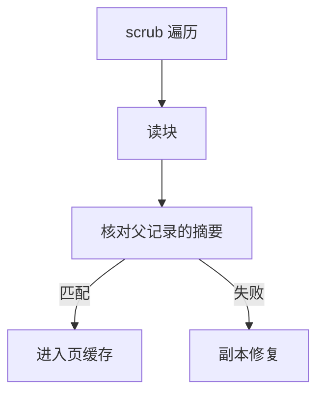

# 校验与 scrub

每个块带校验和，读时核对；scrub 在空闲时把整池读一遍，把静默损坏变成可修复事件。

<footer>—— 据 Bonwick and Moore 对 ZFS end-to-end checksum 的论述；Bairavasundaram et al. 对磁盘静默错误的测量</footer>

[上一课](/cs/cow-filesystem)让树根原子切换，但块从设备回来时可能已经静默翻比特。SCSI/NVMe 的 ECC 停在设备内部；文件系统若只信「读成功」，用户看到的是错数据。[页缓存](/cs/page-cache) 也会把错页当成真。缺口是 **端到端校验 + scrub**。

## 问题

静默损坏（bit rot、错误扇区被重映射成全零、固件写错位）不会总变成 I/O 错误。ZFS 把 checksum 放进父指针（或块头），读路径比较；不匹配则从镜像/RAID 副本修复，再写回。btrfs 同样在树里存校验。缺口不是再讲 COW，而是：校验存在哪、何时算、scrub 如何遍历所有已分配块而不经用户读。

本课不把加密当校验——[dm-crypt](/cs/dm-crypt) 是后课存储栈。

校验算法是 Fletcher、CRC32C 或 SHA 家族的工程选择。对象是「父节点提交了子块的摘要」。scrub 与 fsck 不同：前者验证内容，后者验证结构。

## 方法

写：数据下盘前算摘要，COW 父结点时写入。读：设备返回后先核对再进页缓存；失败则走冗余。scrub：从根遍历（或沿分配位图）发出读，统计错误，能修则修。与 ext4 的 metadata_csum 对照：ext4 可校验元数据，数据校验不是默认主路径；ZFS/btrfs 把数据也纳入。

## 机制

端到端校验把「磁盘说 OK」从信任基里拿掉一层：文件系统知道块应该是什么。COW 很关键——原地改同一块会让校验更新与数据写交织出窗口；新块新摘要随新父结点提交。不要把本课写成网络的 CRC 课：这里的损坏来自存储介质与路径，不是以太网帧。

与 [日志](/cs/ext4-journal) 分工：日志防的是崩溃半更新；scrub 防的是已提交块日后腐烂。

实现上：校验和必须存在父指针里才能端到端：只存在块头则替换整块可以对上自校验。scrub 与用户读路径共用核对，差别是遍历顺序与优先级，不是另一套哈希。 读法上只引用[上一课](/cs/cow-filesystem)的结论，不把对象换成训练推理或限价簿。

本课在操作系统进阶的「文件系统实现 / 布局与日志」课序里，对象是 **校验与 scrub**。

- 先修只引用，不重导：上一课的结论当公理，本课只补差。
- 五栏不吞并：不把本课写成大模型训练/推理，也不写成限价簿或权重量化。
- 文献用 OSTEP、McKusick、内核文档与具名会议论文；不发明 arXiv 编号。

## 边界

本课不引入自我修复的全部 RAID 形状，不保证单盘无冗余时 checksum 失败还能救——那时只能报错。下一课用同一套 COW 根做快照与克隆：校验保证历史切面读回来仍对。

版本字段会变，课序钉的是机制对象「校验与 scrub」，不是某一主线内核的结构体名。
后课默认：已提交块可以带着摘要被巡检。命名一个历史根并共享未改块，下一课快照。

## 小结

- 校验在父指针里；读路径核对。
- scrub 主动遍历，结构检查仍是 fsck 的事。
- 快照与克隆是下一课的缺口。
- 出处：ZFS 校验设计；Bairavasundaram et al.；btrfs checksum 文档。
