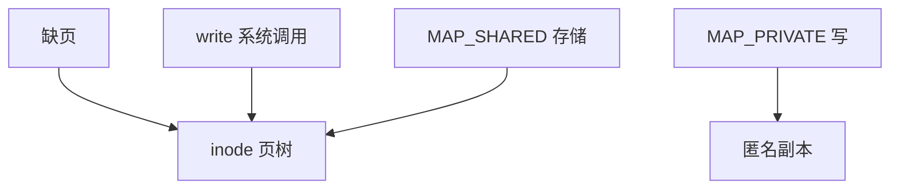

# mmap 与页缓存一致

同一文件偏移应当对应同一页框：read、write 与 mmap 看见的是这一帧，而不是各持一份副本。

<footer>—— 据 POSIX mmap；McKusick 对统一缓冲缓存的演进；Bovet and Cesati 对 address_space 的整理</footer>

[上一课](/cs/fsck)保证盘上结构可检查。运行时另一条裂缝：[页缓存](/cs/page-cache) 已说 read/mmap 共帧，但尚未钉 **MAP_SHARED 写回、MAP_PRIVATE 写时复制、与 msync 的范围**。缺口是一致性，不是再定义缺页。

## 问题

若 mmap 把设备块直接映射进进程，而 read 走另一套缓冲，同一偏移会有两份内容——这是历史教训。统一页缓存后：缺页从 inode 的页树取帧；`MAP_SHARED` 的写改这一帧并标脏；`MAP_PRIVATE` 在写时拷到匿名页，文件视图不变。缺口：`msync` 与 `fsync` 如何对齐；多进程共享映射时谁看见谁的写；`MAP_POPULATE` 只是预填，不改对象。

`MS_ASYNC` 只排队，`MS_SYNC` 等待稳定存储，语义靠近 fsync 的范围版。私有映射的脏匿名页不进文件 writeback。

## 方法

VFS：`mmap` 安装 vma，fault 调 `readpage`/`writepage` 同一套。写共享映射 = 改页缓存。`write` 系统调用也改同一页，于是编辑器 mmap 与后台 checksum 进程 read 不分裂。与 [fsync](/cs/fsync)：对 fd 的 fsync 包含这些脏页。不要假设 `munmap` 等于 msync。

## 机制

共帧让「文件是字节数组」在虚存与系统调用之间成立。数据库用 `O_DIRECT` 故意绕过这一层，以免双重缓存——后课再讲。本课对象是默认路径。与 COW 文件系统：mmap 脏的是页缓存帧，下盘时仍走 FS 的 COW/日志，不在用户页表里完成树根切换。

不要把一致性写成 MESI：CPU 缓存一致性保证的是核间看见同一物理页；本课保证的是 VFS 不给同一偏移两份页框。

实现上：MAP_SHARED 的脏页与 writeback 共用 inode 页树，所以 msync 与 fsync 最终进同一套 writepages。MAP_PRIVATE 的匿名副本在换出时走 swap，不是文件空洞。 读法上只引用[上一课](/cs/fsck)的结论，不把对象换成训练推理或限价簿。

本课在操作系统进阶的「文件系统实现 / 布局与日志」课序里，对象是 **mmap 与页缓存一致**。

- 先修只引用，不重导：上一课的结论当公理，本课只补差。
- 五栏不吞并：不把本课写成大模型训练/推理，也不写成限价簿或权重量化。
- 文献用 OSTEP、McKusick、内核文档与具名会议论文；不发明 arXiv 编号。

## 边界

本课不引入 `userfaultfd` 的全部用户态填页——那是内存进阶。不保证 NFS 上 mmap 与远程写的缓存语义，那是 [NFS](/cs/nfs-semantics) 课。下一课问文件逻辑大小里「没有块」的那些洞：稀疏与穿孔。

版本字段会变，课序钉的是机制对象「mmap 与页缓存一致」，不是某一主线内核的结构体名。
后课默认：共享映射与 read/write 共页缓存帧。逻辑空洞如何不占块、如何打孔归还，下一课稀疏文件。

## 小结

- 共享 mmap 与读写共 inode 页树。
- 私有映射写时拷到匿名页；munmap 不是 msync。
- 稀疏与穿孔是下一课。
- 出处：POSIX mmap；McKusick；Bovet and Cesati, *ULK*；*OSTEP*。
