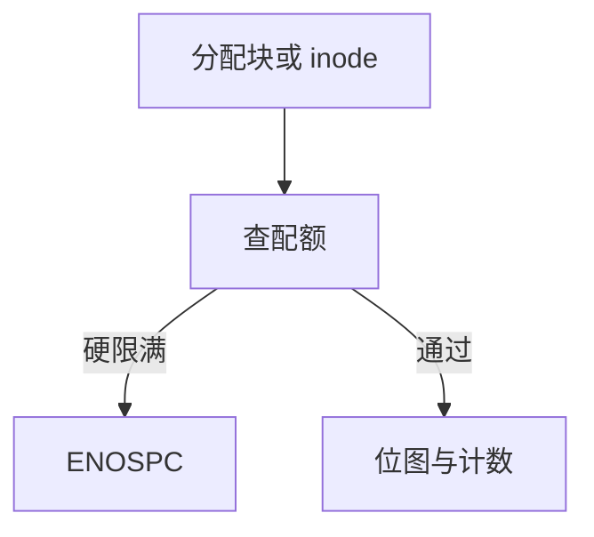

# 配额

配额在分配块与 inode 的路径上记账：软限制可超，硬限制把 creat/write 变成 ENOSPC 一类错误。

<footer>—— 据 McKusick 对 BSD 配额的实现；Linux quota 与 project quota 文档</footer>

[上一课](/cs/xattr-acl)把权限写成 ACL。权限不限制「一个人写满整盘」。缺口是 **配额**：按用户、组或项目给空间与 inode 计数设上限。本课是文件系统实现课序的收口，下一课序才是 overlay 等接口。

## 问题

多用户机器上，位图只知道盘满，不知道是谁吃的。配额文件（或隐藏 inode）记录每个 id 的已用块、已用 inode、软硬限、宽限期。缺口：记账点必须在真正分配时——稀疏写洞不记账，穿孔要减记，[快照](/cs/fs-snapshots) 共享块不能向每个数据集收两次物理块（实现各异，课序要求你问清楚「逻辑 vs 物理」）。`chown` 要把用量从旧 uid 转到新 uid。

软限超了可继续写直到宽限期或硬限。journaled quota 避免崩溃后用量与位图对不上。project quota 用 inode 上的项目 id，服务目录树计费。

## 方法

`write`/`creat` 分配前：查配额，超硬限则失败，不改位图。成功则原子地：位图 + 配额计数（常进同一 [日志](/cs/ext4-journal) 事务）。管理员用 `quotacheck` 对照 fsck 式扫描重建计数。与 VFS：具体 FS 实现 `quota_read` 或走通用 quota 文件。

## 机制

配额把「盘是共享资源」收成可执行的计数器，而不是事后 `du`。它不替代 [cgroup](/cs/cgroups) 的内存限制：对象是持久块。也不替代存储栈的精简配置：精简是设备层「未写不占后端」；配额是 FS 层「你名下不能再占」。不要把本课写成量化风控额度。

崩溃：若计数不进日志，重启后需 quotacheck，类似无日志时的 fsck 税。

实现上：journaled quota 把计数放进与位图同一事务，避免崩溃后用量撒谎。项目配额靠 inode 上的项目 id，mv 跨项目要转账，和 chown 转 uid 是同一类记账。 读法上只引用[上一课](/cs/xattr-acl)的结论，不把对象换成训练推理或限价簿。

本课在操作系统进阶的「文件系统实现 / 布局与日志」课序里，对象是 **配额**。

- 先修只引用，不重导：上一课的结论当公理，本课只补差。
- 五栏不吞并：不把本课写成大模型训练/推理，也不写成限价簿或权重量化。
- 文献用 OSTEP、McKusick、内核文档与具名会议论文；不发明 arXiv 编号。

## 边界

本课不把每个发行版的 `edquota` 教程写进正文。不保证网络 FS 上服务端与客户端配额哪边执行。文件系统实现课序到此：布局、日志、COW、检查、映射、洞、属性、计数都已钉住。下一课序从「单机盘上对象」走到「把一棵树叠到另一棵上」：overlayfs。

版本字段会变，课序钉的是机制对象「配额」，不是某一主线内核的结构体名。
后课默认：分配可被配额挡住。联合挂载如何叠 lower/upper，下一课 overlayfs。

## 小结

- 配额在分配路径记账；硬限失败，软限警告。
- 快照与稀疏要分清计的是什么。
- 联合挂载是下一课序。
- 出处：McKusick, *FreeBSD*；Linux quota 文档；*OSTEP* 对分配的背景。
