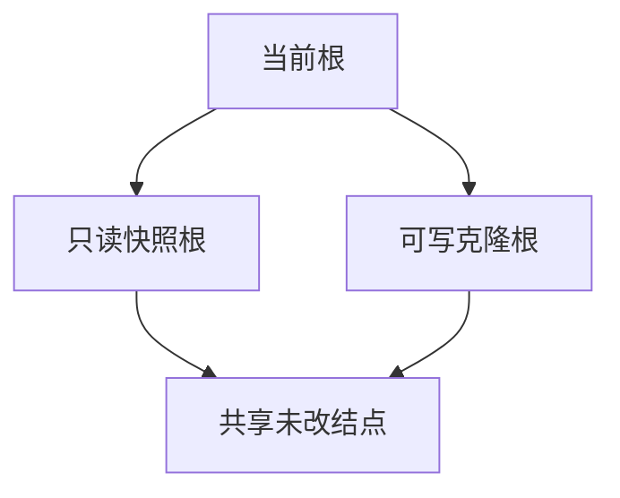

# 快照与克隆

快照是多握一个旧根；克隆是从某根分出可写的新树，未改结点靠引用计数共享。

<footer>—— 据 Rodeh 对 shadowing 与 clone 的分析；ZFS 与 btrfs 对 snapshot/clone 的接口整理</footer>

[上一课](/cs/fs-checksum-scrub)保证旧块读出来可验证。[COW](/cs/cow-filesystem) 已经能留下旧根。缺口是**给用户的命名与可写分叉**：快照只读、克隆可写、子卷如何从同一池里长出来。本课不把容器镜像层提前写成 overlay——那是接口课。

## 问题

备份若拷贝整棵树，空间与时间都按容量计。COW 下「备份」可以是：原子记下当前根，引用计数加一。之后的写只碰新路径。克隆：对新根允许分配新叶，两边同时可写。缺口：何时增加计数、删除快照如何回收只被该根看见的块、以及与 [配额](/cs/fs-quota) 后课的交叉（快照占用算谁的）。

ZFS 的 snapshot 是只读数据集；clone 可写。btrfs 的 snapshot 默认可写，本质是新 subvolume。教学上区分「只读钉住」与「可写分叉」。

## 方法

创建快照：事务中复制根指针，计数 +1，目录里出现新名字。写原数据集：COW 路径，不碰快照仍引用的结点。删除快照：从该根能到达、且计数降为零的块释放。发送/接收（ZFS send、btrfs send）把两根之间的差量化成流，这是机制上的增量备份，本课只点名。

## 机制

快照把时间变成树的额外入口，而不是 LVM 那层块设备的写时复制（虽然 dm-snapshot 也是 COW，对象是块设备不是 FS 树）。与 FAT/ext2 对照：那些布局没有便宜的旧根。不要把本课写成量化栏的快照订单簿。LVM 快照在存储栈后课；这里的粒度是文件树。

读快照走旧根，[页缓存](/cs/page-cache) 必须按 (inode 世代 / subvol) 区分，不能把克隆后的脏页当成快照内容。

实现上：可写快照与克隆在实现上常是同一套加根，只读只是权限。发送增量依赖两根能算差集；若重写同一逻辑块多次，发送流仍只含最后版本相对基线的差。 读法上只引用[上一课](/cs/fs-checksum-scrub)的结论，不把对象换成训练推理或限价簿。

本课在操作系统进阶的「文件系统实现 / 布局与日志」课序里，对象是 **快照与克隆**。

- 先修只引用，不重导：上一课的结论当公理，本课只补差。
- 五栏不吞并：不把本课写成大模型训练/推理，也不写成限价簿或权重量化。
- 文献用 OSTEP、McKusick、内核文档与具名会议论文；不发明 arXiv 编号。

## 边界

本课不保证任意 POSIX 语义下 rename 与快照的每一种竞态都有发行版级描述。不引入 overlayfs 的 lower/upper——下一课序才是接口。下一课回到「不 COW 也能尽量保持一致」：软更新如何在原地更新里排序缓冲。

版本字段会变，课序钉的是机制对象「快照与克隆」，不是某一主线内核的结构体名。
后课默认：历史根可命名、可共享块。若坚持 FFS 原地更新，用依赖序代替日志与 COW，下一课软更新。

## 小结

- 快照加根；克隆可写分叉；共享靠计数。
- 回收是计数降零的块，不是删名字本身。
- 软更新是下一课的对照缺口。
- 出处：Rodeh, TOS 2008；McKusick；ZFS/btrfs 手册中的 snapshot。
