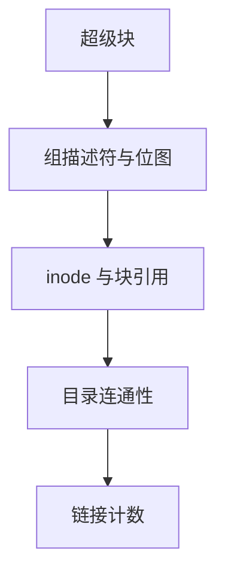

# fsck

fsck 从超级块走进位图、inode 与目录，把「结构不变量」从盘上核对一遍；能修则修，不能则标坏。

<footer>—— 据 McKusick and Kowalski 对 fsck 的论述；Arpaci-Dusseau, <em>OSTEP</em> 对一致性检查的整理</footer>

[上一课](/cs/soft-updates)把泄漏交给后台回收。[日志](/cs/ext4-journal) 把重放当成主恢复路径。无论哪条路，仍需要一个**离线或只读在线的检查器**，把不变量写成程序。缺口是 fsck 扫什么，而不是再发明 inode。

## 问题

不变量包括：每个已分配块恰被一个 inode 指向（或空闲）；目录项的 inode 已分配且类型匹配；`.` / `..` 成树；链接计数等于目录项数。无日志的 [FAT](/cs/fat-filesystem) / 老 ext2 崩溃后必须全量跑。有日志时，正常 umount 只设 clean 标志，fsck 跳过；脏挂载先重放再抽查。缺口：阶段（超级块、柱面组/块组、inode、连通性、引用计数）以及「修」与「只报」的差别。

e2fsck、fsck.f2fs、btrfs check 对象不同，阶段同构。不要在生产上对 COW 池用「按 FAT 思路重建簇链」。

## 方法

读超级块与备份，确认块组描述符。扫 inode 表，统计块引用，对照位图。走目录树，发现悬空 inode（已分配无目录项）放 `lost+found`。修正链接计数。FAT 的 scandisk 类工具扫簇链环与交叉。与 scrub 对照：[scrub](/cs/fs-checksum-scrub) 信树结构去读数据校验；fsck 先信或重建结构。

## 机制

fsck 把文件系统从「可能的字节」变成「满足不变量的元数据」。它不能恢复被覆盖的用户数据，只能让树可挂载。日志缩小了必须跑全量的概率；COW 把「半更新树」变成不太该出现的事件，检查器更多是校验与配额审计。不要把 fsck 写成数据库的 `CHECK TABLE`：没有元组模式，只有块与目录。

强制 fsck 的策略（周期、错误挂载）是运维旋钮；课序只要求：检查器是布局的对偶程序。

实现上：e2fsck 的 pass 顺序不能随意调换：先确认位图与 inode 表完好，再谈目录树，否则会把坏指针当合法硬链接。日志文件系统在 clean 标志下跳过，脏挂载则先重放再决定是否全量。 读法上只引用[上一课](/cs/soft-updates)的结论，不把对象换成训练推理或限价簿。

本课在操作系统进阶的「文件系统实现 / 布局与日志」课序里，对象是 **fsck**。

- 先修只引用，不重导：上一课的结论当公理，本课只补差。
- 五栏不吞并：不把本课写成大模型训练/推理，也不写成限价簿或权重量化。
- 文献用 OSTEP、McKusick、内核文档与具名会议论文；不发明 arXiv 编号。

## 边界

本课不引入每个 FS 的全部交互式提问项。不保证修完后应用级文件内容正确。下一课从结构一致转到运行时：`mmap` 与 `read` 是否看见同一页，页缓存与文件映射如何共帧。

版本字段会变，课序钉的是机制对象「fsck」，不是某一主线内核的结构体名。
后课默认：盘上结构可由检查器核对。同一文件的映射视图与系统调用视图如何共页，下一课 mmap 一致。

## 小结

- fsck 按阶段核对位图、inode、目录与计数。
- 日志/COW 减少全量修复，不取消检查器。
- mmap 与页缓存一致是下一课。
- 出处：McKusick and Kowalski；*OSTEP*；e2fsprogs 文档。
