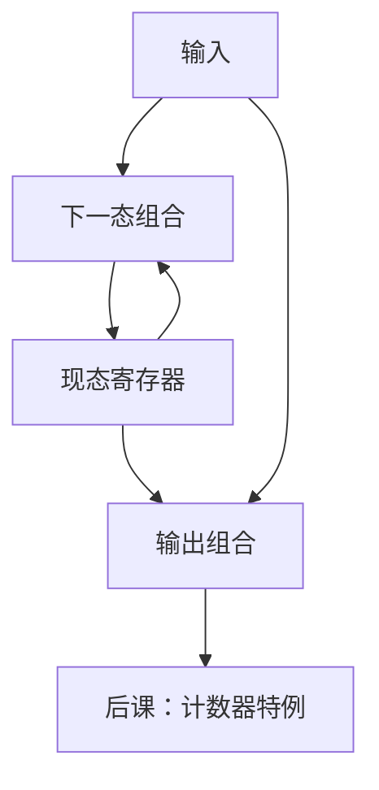

# 有限状态机

现态存在寄存器里，下一态与输出都是现态和输入的组合函数；控制器先画成这样一份图。

<footer>—— 据 Harris and Harris, Digital Design and Computer Architecture 整理</footer>

上一课[寄存器与移位](/cs/register-shift)钉死了 $n$ 位使能寄存器。本课不重讲桶形移位，也不从自动机理论的正则语言另起。缺口是：寄存器可以存任何比特，还没有约定这些比特表示**控制步骤**。后课多周期 CPU、总线协议、外设，都要把步骤画成有限状态机。

## 问题

组合网瞬时，时序需要「现在处于哪一步」。缺口是 FSM：有限状态集 $S$，输入字母、输出字母，转移 $\delta:S\times\Sigma\to S$，输出 $\lambda$ 或 Moore 的 $\lambda:S\to$ 输出。现态用 $[\log_2|S|]$ 位寄存器（或独热）。下一态逻辑与输出逻辑是组合，必须满足建立保持。

Mealy 输出依赖输入，路径更短或更长取决于是否把输入算进关键路径；Moore 输出只看状态，往往更稳、多一拍。本课两种都承认，后课控制器常用混合。

### 状态图不是程序流程图

边是时钟拍上的转移，不是「函数调用」。无时钟的异步状态机不在主干。把 FSM 画成可以停留在组合环里等握手而无状态寄存器，会绕过上一课的 FF。

Harris 用交通灯、序列检测当例子。后课多周期取指/译码/执行是同一套：每个圆圈一拍。本课不引入微程序 ROM，那是更后一课。

## 方法

列状态、编码、画 $\delta$ 与 $\lambda$ 的真值表，用卡诺图或 HDL 综合成下一态与输出组合，接到寄存器 D 端。复位把状态送到已知编码。

## 机制

独热编码让输出常是单触发器，下一态逻辑简单，FF 用得多。二进制编码省 FF，译码更重。后课控制真值表可以是「指令 × 状态」的大 ROM，仍是本课 FSM 的实现。非法状态应导向复位或陷阱，与无关项政策一致。

## 边界

本课不证正则语言等价、不把下推自动机请进来。不讨论状态最小化算法细节。连续控制、PID 不是 FSM。

后课默认：控制器是同步 FSM；现态在寄存器，转移每拍一次。计数器是状态沿环走的特例。

## 小结

- FSM = 状态寄存器 + 下一态/输出组合。
- Moore/Mealy 差在输出是否看输入。
- 编码在独热与二进制之间权衡。
- 出处：Harris and Harris。
