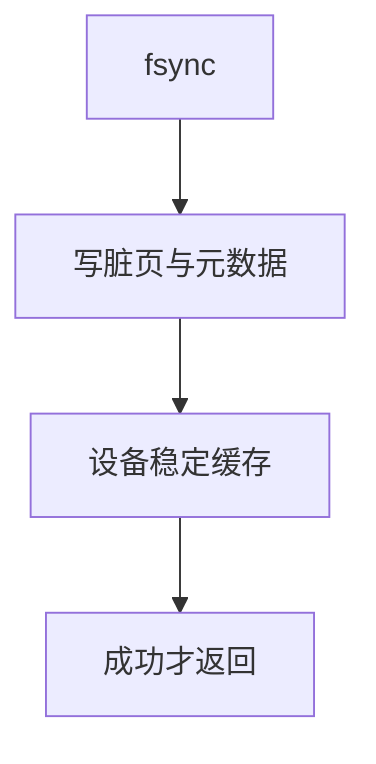

# fsync

fsync 要求该文件的脏数据以及必要的元数据到达稳定存储之后才返回；write 本身不提供这条保证。

<footer>—— 据 POSIX fsync；McKusick 对 FFS 稳定存储的讨论</footer>

[上一课](/cs/writeback)是后台尽力。[缓冲与脏页](/cs/buffer-dirty) 已点名 fsync。缺口是**同步点**：谁等待、等待哪些块（数据页、inode、目录项、日志）、以及 `fdatasync` / `O_SYNC` 如何减范围。不是崩溃后如何重放——那是日志课。

## 问题

编辑器保存若只 `write`，电源一断文件可能是旧的或空洞。若每次 `write` 都同步，交互式程序卡死。缺口：`fsync(fd)` 把该 inode 的脏页与元数据排队并等待设备完成（含存储控制器的 flush 命令，若平台提供）。失败要返回错误；成功后 POSIX 允许假定内容持久——硬件谎报则 OS 无法挽救。

本课不把每个控制器的 `FLUSH`/`FUA` 编码写完。

`fdatasync` 可不把未改的 inode 时间等元数据刷出。`O_SYNC` 让每次写都等价带同步。目录持久还要对目录 fd 做 fsync，否则新文件名可能丢。

## 方法

内核：对该 file 的页 Cache 做 writeback，提交 inode 与必要间接块，下发设备缓存刷新，睡眠直到完成 IRQ。与 [writeback](/cs/writeback) 共用 `writepages`，只是调用者等待。多线程对同一文件 fsync 可合并。不要假设 `close` 等于 fsync——POSIX 不要求 close 刷盘。

## 机制

fsync 把「脏」从性能优化接回正确性接口：数据库、编辑器、安装器在关键点调用它。它不能单独保证崩溃一致性——只保证这一个文件的某些块顺序到达；目录项与 inode 的相对顺序仍可能错，于是需要下一课日志。本课只钉等待。

与 [WAL](/cs/wal) 对照：数据库用自己的日志加 fsync；文件系统可以在下面再做一份，对象不同。

## 边界

本课不引入 `syncfs` 整机刷的全部语义。不把电池后备磁盘当默认从而宣称 fsync 可空操作。下一课 ext4 用日志把多次元数据更新捆成原子，减少 fsync 次数与 fsck。

后课默认：程序可以等待单文件持久。元数据多块原子，下一课日志模式。

## 小结

- fsync 等待该文件脏数据与必要元数据落稳定存储。
- close 不是 fsync；目录名要另刷。
- 多块元数据的原子性是日志课的缺口。
- 出处：POSIX.1 `fsync`；McKusick et al., *4.4BSD*；Silberschatz et al., *OSC*。
