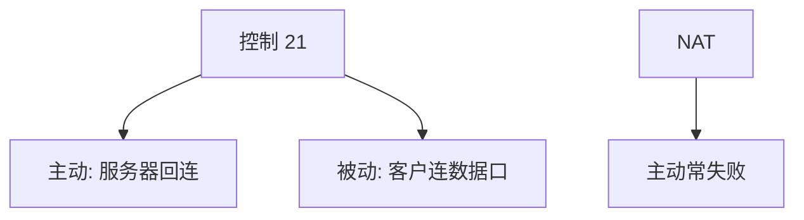

# FTP 被动模式

控制连接在 21，数据连接另开端口；主动模式让服务器回连客户，NAT 失败；PASV 让客户去连服务器宣告的端口。

<footer>—— 据 RFC 959 FTP；RFC 2428 IPv6 PASV；RFC 1579 防火墙友好整理</footer>

[NAT](/cs/dhcp-nat) 改了谁能回连。[上一课](/cs/ptp-precision-time) 结束时间。缺口是 **FTP 双连接**与被动模式：为何当代少用但仍能讲清 NAT 与 ALG。本课结束名字、时间与邮件课序。

## 问题

FTP：PORT 命令告诉服务器客户数据口，服务器向客户发起——客户在 NAT 后无映射则失败。PASV：服务器说「来连我的 (h1,h2,p1,p2)」，客户主动连，NAT 友好。IPv6 用 EPSV。应用层网关改包内地址，脆弱。SFTP（SSH 子系统）与 HTTP 上传用单连接，避开这坑。

不要把 FTP 当推荐文件协议。

RFC 959。本课对照 NAT，不教匿名镜像运营。

### 载荷嵌地址与 NAT 冲突

主动回连失败；PASV 让客户发起。ALG 在加密后失效。当代用单连接协议替代。

## 方法

画主动 vs 被动谁发起数据 TCP。对照 HTTP 单连接 GET。与负载均衡：数据口随机，防火墙要动态开洞或 ALG。

方法止于选定对象与对照；机制才说它如何嵌入已有分层与主干课。

## 机制

PMTUD、TLS（FTPS）让双连接更痛。Cookie 无。多播无。当代对象是理解「载荷里嵌地址」与 NAT 冲突——SIP 同类，点名。

安全：明文 FTP 泄露口令，应淘汰。

## 边界

本课不引入 FTP 的每一条命令。BitTorrent 与 DHT 是下一课序第一课。后课默认：被动模式为了 NAT；新协议避免分离数据连接。

把 ALG 当安全边界会在加密后失效。

上一课留下的缺口在本课收口；「FTP 被动模式」进入后课词汇表后只引用。文献用来钉对象与边界，不把本课写成该主题的独立综述。下一课[BitTorrent 与 DHT](/cs/bittorrent-dht)。

## 小结

- 控制与数据分离，主动回连破 NAT。
- PASV 让客户发起数据连接。
- 单连接协议是更干净的替代。
- 后课只引用本课钉死的对象，不从该领域总问题重开。
- 出处：RFC 959；RFC 1579。
