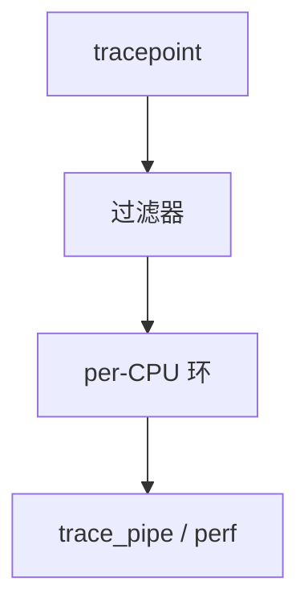

# ftrace 与 tracepoints

tracepoint 是编译进内核的钩，默认几乎为零成本；ftrace 把它们接到环形缓冲，并可做函数图与过滤。

<footer>—— 据 Rostedt 对 ftrace 的论述；Linux tracepoint 文档；[printk](/cs/printk-logging) 为重日志对照</footer>

[printk](/cs/printk-logging) 太重。[NAPI](/cs/napi) 路径不能每包打印。缺口是 **ftrace**：tracepoint、function tracer、ring。

## 问题

`TRACE_EVENT` 定义字段。启用才把探针插入。缺口：buffer per-cpu；过滤 pid/comm；function tracer 用 mcount。本课不把每个事件名列出。

tracefs 是接口。对象是事件流，不是 gdb。与 eBPF 后课可共用 tracepoint。

## 方法

`echo 1 > events/.../enable` → 事件写 per-cpu 缓冲 → `trace_pipe` 读。对照 [perf](/cs/perf-sampling) 后课：perf 可消费同一点。对照 [inotify](/cs/inotify)：一个文件树，一个内核执行点。对照 ASan：一个找空间错，一个找时间线。

## 机制

ftrace 把「生产内核可观测」收成零开销默认 + 按需启用，是调试延迟与调度的主工具。不要写成 APM 产品。与 [PREEMPT_RT](/cs/preempt-rt)：tracer 本身扰动，要测开/关。

错误过滤仍可让缓冲溢出丢事件。

实现上：per-cpu 缓冲避免全局锁，读的时候可能看到撕裂，工具用页头同步。function tracer 用 mcount/patchable 入口，和 livepatch 抢同一套改代码机制。 读法上只引用[上一课](/cs/printk-logging)的结论，不把对象换成训练推理或限价簿。

本课在操作系统进阶的「安全、启动与调试 / 观测与调试」课序里，对象是 **ftrace 与 tracepoints**。

- 先修只引用，不重导：上一课的结论当公理，本课只补差。
- 五栏不吞并：不把本课写成大模型训练/推理，也不写成限价簿或权重量化。
- 文献用 OSTEP、McKusick、内核文档与具名会议论文；不发明 arXiv 编号。

## 边界

本课不引入所有 tracer 插件。不保证模块事件的稳定性。下一课动态打点：kprobes。

版本字段会变，课序钉的是机制对象「ftrace 与 tracepoints」，不是某一主线内核的结构体名。
后课默认：静态 tracepoint 可低成本启用。动态探针 kprobe/uprobe，下一课。

## 小结

- tracepoint 默认便宜；ftrace 收集到 per-CPU 环。
- 函数跟踪更重，适合短时。
- kprobes 是下一课。
- 出处：ftrace 文档；Rostedt；tracepoint。
