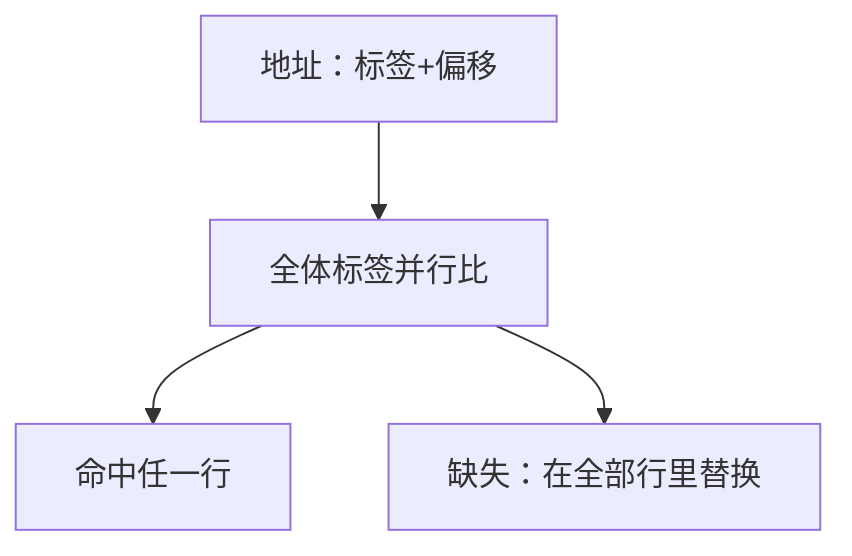

# 全相联对照

块可以放进任意一行时，冲突缺失消失，比较器却要与行数一起涨；它是组相联在 $n$ 取到总块数时的端点，不是默认的大 cache。

<footer>—— 据 Patterson and Hennessy, Computer Organization and Design (RISC-V)；Hennessy and Patterson, CA:AQA 整理</footer>

[上一课](/cs/set-associative-replace)用索引选组、组内多路比标签，并写明 $n$ 等于总块数就是全相联。本课不重讲 LRU 位。缺口是把这个端点单独钉死：没有索引字段，整块地址当标签，用相联存储器（CAM）一次比完；以及它适合小结构（TLB）而不适合兆字节数据 cache。

## 问题

组相联仍可能在一组内互踢，哪怕别的组空着——那是冲突缺失。把相联度加到「只有一组」，冲突项相对同容量全相联的差额为零。缺口不是新的替换哲学，而是**地址不再切出索引：查找是全体标签并行比较**，命中时间与面积随行数线性变差。

上一课说常用 2 路或 4 路。本课解释为什么不大到全相联去做数据 cache，却又在 TLB、小 victim 缓冲里用它。

CAM 每行一份比较器。数据 SRAM 可以很大；标签 CAM 做大，时钟和功耗先垮。

## 方法

全相联 cache：地址切成标签与块内偏移，无索引。$N$ 行则 $N$ 路并行比标签，命中 mux 选出数据。替换在「整个 cache」这一组上做 LRU 或随机；真 LRU 状态随 $N$ 的阶乘涨，实践用近似。

直接映射是 1 路；全相联是 $N$ 路单组。组相联夹在中间。三种映射共享同一套「标签匹配才命中」的语义。

## 机制

冲突缺失降到零之后，剩下强制与容量。[缺失分类](/cs/cache-miss-types)会用「同容量全相联」当参照——本课先把这个参照机器造出来。命中时间上升会吃掉 CPI 收益：阿姆达尔项从缺失停顿转到周期变长。

TLB 条目少（几十到几百），全相联划算，而且 VPN 不宜随便切索引（页号分布不保证均匀）。数据 L1 要支撑每拍 load，常用低相联度换短命中。

## 边界

本课不引入写回，不讨论 inclusive 层次。victim cache 是「很小的全相联」挂在直接映射旁边，用来收冲突牺牲品，附录手段，主干不依赖。也不把全相联写成「没有替换」：满了仍要踢，只是候选是全体行。

后课默认：谈到大容量数据 cache，默认组相联；谈到 TLB 或极小缓冲，允许全相联。写策略是下一课。

## 小结

- 全相联 = 单组、$N$ 路，无索引，冲突缺失为零。
- 比较器与真 LRU 随 $N$ 变贵；大数据 cache 不用它当默认。
- 写回与脏位是下一课的缺口。
- 出处：Patterson and Hennessy, *COD* RISC-V；Hennessy and Patterson, *CA:AQA*。
