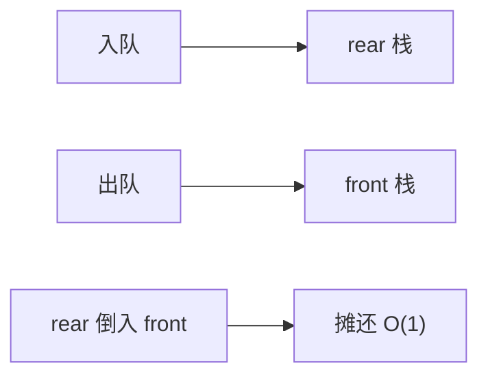

# 函数式队列

前栈出队、后栈入队；后栈倒进前栈时一次线性，摊还仍 $O(1)$。旧版本的两栈指针保持持久。

<footer>—— 据 Okasaki, Simple and Efficient Purely Functional Queues and Deques, JFP 1995；Okasaki, Purely Functional Data Structures；Hood and Melville 整理</footer>

[上一课](/cs/persistent-path-copy) 给了树的复制。[双端队列](/cs/deque) 与[摊还](/cs/amortized-analysis) 在命令式数组上已出现。函数式不能原地改链表头尾而不影响旧版本。本课不旋转 BST。缺口是双列表队列：`front` 与 `rear`（rear 逆序存），倒栈维持平衡。

## 问题

单链表：入队若只改尾，旧版本的尾无法共享地接上新节点而不改变旧队列。入队全在头则 FIFO 变 LIFO。Hood–Melville / Okasaki：维护两个列表 $f,r$，不变量常 $|r|\le|f|$（变体多）。入队：cons 到 $r$。出队：从 $f$ 头拿；若 $f$ 空则 reverse $r$ 成新 $f$。缺口是**倒栈次数被长度摊还**，且每次操作返回新对 $(f',r')$，旧对仍可用。

Okasaki *JFP* 1995 与专著。惰性流可把 reverse 渐进执行，最坏也 $O(1)$ 步（更细）。本课先钉摊还双栈。

## 方法

`snoc(x)`：`(f, x::r)`，若违不变量则 `rotate`。`head`/`tail` 走 $f$。持久：cons 共享前缀，reverse 产生新链，旧 $r$ 仍在。

与 Michael–Scott 无锁队列：那是命令式共享内存；本课不可变。与 Rope：Rope 是随机访问序列，队列只端点。

## 机制

势能 $|r|$ 或类似，倒栈花 $\Theta(|r|)$ 时势能下降。实时变体用惰性，避免单次峰值——若实时路径不能倒整个 $r$，用 Okasaki 的流。不要用函数式队列当高性能 SPSC 环（那是数组 + 原子）。

下一课缓存无关：换的是递归布局与 I/O 模型，不必持久。

## 边界

本课不把实时 deque 的全部旋转写完。无锁进度是后课 CAS 队列。磁盘 B 树的缓存有关分析与 cache-oblivious 对偶，下一课。

后课默认：持久 FIFO 用双栈/惰性队列。最优缓存利用不依赖 $B$ 参数的结构，用缓存无关模型。

## 小结

- 函数式队列：两栈，倒栈摊还 $O(1)$，版本共享。
- 惰性可消峰值。
- 下一课 I/O 与递归布局。
- 出处：Okasaki, *JFP*, 1995 与专著；Hood and Melville。
