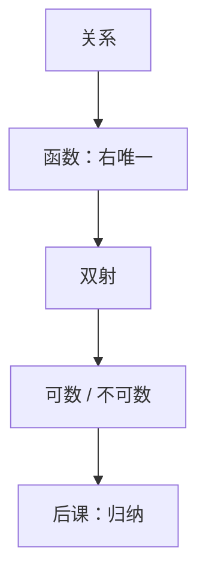

# 函数与可数

函数是右唯一的关系；两个集合一样大，当且仅当存在双射。可数，就是能和自然数一一对上。

<footer>—— 据 Rosen, Discrete Mathematics and Its Applications 整理</footer>

上一课[偏序与格直觉](/cs/poset-lattice)钉死了子集与有序对。本课不重讲自反对称传递，也不从「无穷哲学」另起。缺口是：关系太宽。计算要的是「每个输入恰好一个输出」，以及「这一堆对象能不能编号」。没有这两条，后课归纳没有指标集，渐近记号没有 $n\to\infty$ 的对象。

## 问题

布尔函数已经是 $\{0,1\}^n\to\{0,1\}$，但一般对应 $f:A\to B$ 要写成：对每个 $a\in A$ 恰有一个 $b$ 使 $(a,b)\in f$。单射、满射、双射把「能否反推、能否盖住」说清。缺口的另一半：无限集不能靠数元素个数。Cantor 的标准：**可数**当且仅当与 $\mathbb{N}$ 存在单射（或等价地，有限或与 $\mathbb{N}$ 双射，说法按教材选一种并固定）。

$\mathbb{N}$、$\mathbb{Z}$、$\mathbb{Q}$ 可数；$\{0,1\}^{\mathbb{N}}$ 与 $\mathbb{R}$ 不可数——对角线。本课只要这个对照：比特串长度有限则有限；无限长比特序列已经不可数。后课算法输入默认有限串。

### 可数不是「能列成程序打印出来」

可计算枚举是更严的一层，本课不要。可数只要求存在双射，不必给出算法。把「整数可数」说成「计算机能列完」，会与停机问题撞车，那是附录与计算理论，不插入本主干。

Rosen 把鸽笼原理写成有限单射的推论。可数无限的鸽笼要另说。本课的双射是计数的语言；渐近记号用的 $n$ 是这个 $\mathbb{N}$。

## 方法

检查右唯一与左完全得函数。复合、限制按集合定义。可数：给出枚举 $a_0,a_1,\ldots$ 允许重复则是满射 $\mathbb{N}\to A$，再收缩成双射。对角线：若 $f:\mathbb{N}\to\{0,1\}^{\mathbb{N}}$，令 $d(i)=1-f(i)(i)$，则 $d$ 不在值域。

## 机制

有限字母表上的有限串 $\Sigma^*$ 可数：按长度再按字典序。这保证「所有程序」「所有有限图」可数，后课才能谈「某个算法是否存在」。不可数的对象（任意实数、任意无限执行轨迹）不能当输入写完。机器字是有限 $n$，所以[进制](/cs/positional-notation)的集合有限。

鸽笼：有限集到更小有限集没有单射。后课哈希碰撞、鸽笼选重复，用的就是这一条，不另造原理。

## 边界

本课不引入基数 $\aleph_1$、连续统假设。不把偏函数、可计算函数混进「函数」一词：后课算法可以在某些输入上不停，那是偏的，本课的函数是全函数。

后课默认：谈到编号、枚举、输入长度 $n$，集合是有限或可数；函数是右唯一的关系。

## 小结

- 函数是每个左端点恰好一条边的关系；双射定义「一样大」。
- 有限串可数；无限比特序列不可数。
- 鸽笼是有限单射的否定。归纳的指标是 $\mathbb{N}$。
- 出处：Rosen, *Discrete Mathematics*。
