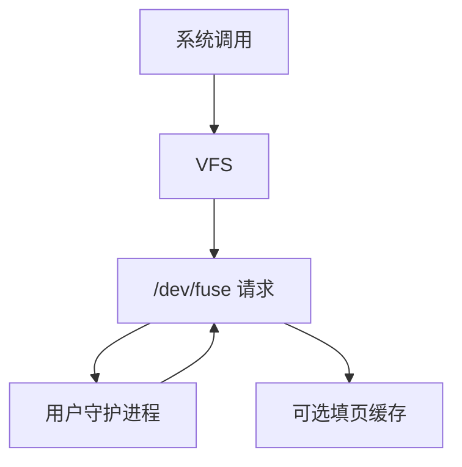

# FUSE

FUSE 把 VFS 操作编成发往用户守护进程的请求；真正的 lookup/read 在用户态完成，再把结果填回内核页缓存。

<footer>—— 据 Szeredi, FUSE；Linux fuse 文档；Vangoor, Tarasov, Zadok 对 FUSE 性能的测量</footer>

[上一课](/cs/overlayfs)仍在内核里叠两棵内核 FS。[VFS](/cs/vfs) 的操作表也可以指向一个**把请求送出内核**的驱动。缺口是 FUSE：让 sshfs、ntfs-3g、用户态实验 FS 不必进内核树。

## 问题

内核实现新 FS 要模块、许可证、崩溃半径。FUSE：内核模块登记 fuse 超级块；用户守护进程通过 `/dev/fuse` 读请求、写应答。read 可能两次拷贝（内核到守护、守护到内核页）。缺口：请求类型（lookup、open、read、write、setattr）、多线程守护、以及 `cache_readdir` 与内核 [dcache](/cs/dcache) / [页缓存](/cs/page-cache) 如何可选地缓存用户态结果。

deadlock：守护进程自己再访问同一挂载点会卡住。解决方案是克隆线程、或 `fuse_conn` 的 abort。本课不写 libfuse API 教程。

## 方法

用户 `open`：VFS → fuse → 队列 → 守护 `open` 回调 → 返回句柄。`read`：内核或可把请求与页一起交给守护，守护填缓冲，内核插入页树。写路径类似，fsync 变成用户态 fsync。对照 overlay：联合可以在用户态做（unionfs-fuse），慢但可实验。对照内核 ext4：没有系统调用往返。

## 机制

FUSE 把文件系统变成普通进程：可用脚本语言、可调试、崩溃不带倒内核（挂载点会 I/O 错误）。税是上下文切换与拷贝。不要把 FUSE 写成数据库用户态存储引擎综述：接口仍是 POSIX 文件，不是 SQL。

安全：挂载通常允许用户在自己的目录上 `fusermount`，节点由 MNT_NOSUID 等限制；这是策略，对象仍是请求协议。

实现上：FUSE 的 daemon 若单线程且再访问同一挂载点，会自死锁。内核可 abort 连接把等待者唤醒为 ENODEV。writeback 缓存开启时语义更像本地 FS，关闭则更像严格 RPC。 读法上只引用[上一课](/cs/overlayfs)的结论，不把对象换成训练推理或限价簿。

本课在操作系统进阶的「文件系统实现 / 接口进阶」课序里，对象是 **FUSE**。

- 先修只引用，不重导：上一课的结论当公理，本课只补差。
- 五栏不吞并：不把本课写成大模型训练/推理，也不写成限价簿或权重量化。
- 文献用 OSTEP、McKusick、内核文档与具名会议论文；不发明 arXiv 编号。

## 边界

本课不引入 virtio-fs、fuse-bpf 的全部加速路径。不保证与 [SELinux](/cs/lsm-selinux) 标签透传的每一种组合。下一课把「文件在另一台机器」的语义裂缝钉住：NFS 的缓存与关闭-打开一致性。

版本字段会变，课序钉的是机制对象「FUSE」，不是某一主线内核的结构体名。
后课默认：VFS 操作可以出核。远程文件语义与本地 POSIX 差在哪，下一课 NFS。

## 小结

- FUSE 用 `/dev/fuse` 把 VFS 请求交给用户态。
- 可缓存进 dcache/页缓存，默认仍有往返税。
- 远程语义是下一课。
- 出处：Linux fuse 文档；Vangoor et al. 对 FUSE 性能；Szeredi。
