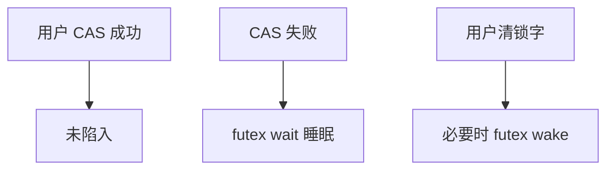

# futex

未争用时用户用原子指令改一个对齐的整字；只有需要睡眠或唤醒时才陷入内核——这就是快速用户空间互斥。

<footer>—— 据 Franke, Russell and Kirkwood, Fuss, Futexes and Furwocks；Love, LKD 整理</footer>

[上一课](/cs/mutex-sleep)的内核 mutex 每次获取都在内核对象上转。用户进程有自己的锁字，若无争用不应付[系统调用路径](/cs/syscall-path)的税。缺口是 **futex**：用户地址上的整数 + 内核里按该地址排队的等待者。本课钉未争用快路径与陷入慢路径，不写全部操作码。

## 问题

纯用户自旋：持有者被切走则空转。纯系统调用锁：未争用也陷入。futex：`cmpxchg` 把字从 0 改成 1 即得锁；失败则 `FUTEX_WAIT` 把当前线程挂到该用户地址对应的内核队列上。释放：用户把字清 0，若可能有等待者则 `FUTEX_WAKE`。缺口不是再定义所有者——用户库可在字旁另存 tid——而是**内核只介入睡眠**。

等待队列键是「这块内存」：进程私有 futex 用 mm+地址；共享 futex 用 inode 或文件映射，使进程间锁成为可能。

## 方法

库：未争用 TAS/CAS；争用则 wait。内核：校验用户地址可写，把任务挂到哈希到该 futex 的队列，睡眠。wake：找到队列唤醒 n 个。与[重启系统调用](/cs/restart-syscall)：wait 可被信号打断。PI futex 把所有者 tid 写进字里，供内核 boost，对接[PI](/cs/pi-pcp)。

不要在内核里解释锁的高层语义；内核只卖睡眠与唤醒。

## 机制

futex 把[临界区](/cs/race-critical) 的实现拆成用户原子 + 内核等待队列。未争用路径无陷入、无内核锁对象泄漏。进程退出时内核要清理该任务挂过的 futex 等待，以免幽灵唤醒。与[copy_from_user](/cs/copy-from-user) 不同，锁字就在用户页上，内核用原子访问那一页，仍须防缺页与卸载。

## 边界

本课不把所有 `FUTEX_*` 命令当手册，不讨论如何用错误的 wake 做拒绝服务细节。条件变量可用 futex 做等待队列，完整管程在已有课。下一课把「多人只读、一人写」做成 rwlock。

后课默认：用户锁未争用走原子，争用走 futex。读多写少时一把互斥太粗，下一课读写锁。

## 小结

- futex：用户字上的快路径 + 内核按地址睡眠。
- 内核不管锁语义，只 wait/wake。
- 读写锁是下一课。
- 出处：Franke et al., *Ottawa Linux Symposium*；Love, *LKD*。
