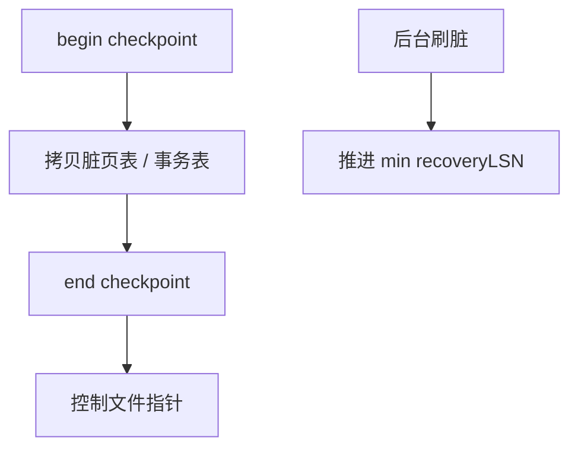

# 模糊检查点

检查点不冻结世界：记下当时的脏页与活跃事务，后台继续刷；恢复用这份快照当分析起点，而不是要求检查点瞬间数据文件干净。

<footer>—— 据 Mohan ARIES 检查点；Gray and Reuter；主干 checkpoint 课的模糊补全</footer>

[上一课](/cs/aries-phases-clr)从检查点 LSN 开分析。本课不写 CLR。缺口是检查点本身：若采取 sharp（停更新、刷光脏页）则吞吐归零。模糊检查点（fuzzy checkpoint）允许检查点期间页继续变脏，只保证记录了「这些页可能脏、这些事务活跃」，redo 仍从足够早的 LSN 开始。

## 问题

主干 [检查点](/cs/checkpoint) 缩短恢复。模糊：写 begin-checkpoint，拷贝脏页表与事务表，写 end-checkpoint，再把检查点指针进控制文件。拷贝期间新脏页不在表里？规则是：拷贝后变脏的页，其 recoveryLSN 仍 ≥ 检查点，redo 从检查点前足够早处扫会覆盖。细节在 ARIES：脏页表含当时未刷页。

缺口是**与刷脏并行**：检查点不代替刷脏；后台写者降低 min recoveryLSN，使下次检查点更紧。两者一起决定 RTO。

模糊不是「随便丢日志」。WAL 仍先于页。检查点只限制崩溃后必须扫描的日志前缀。

## 方法

周期或按日志体积触发。太频：写检查点记录与控制文件成为瓶颈。太稀：恢复扫太多。与组提交：检查点 LSN 之前的日志必须已持久。

复制：备库的 replay 位置类似检查点水位。备份常与检查点对齐拿一致点。

## 机制

恢复分析从最近完成的 end-checkpoint 走。半截检查点忽略，用上一个。与 TDE：检查点记录可含密钥版本。与缓冲 2Q：刷脏偏好老脏页，不是刚扫描的一次性页——策略与检查点目标对齐。

模糊检查点期间的崩溃：未完成检查点无效，正确性靠上一完成点+后续日志。

## 边界

本课不比生理 vs 逻辑日志粒度。也不把检查点当 vacuum。RTO 课把时间预算量化。

后课默认：生产用模糊检查点+后台刷脏。日志粒度：记字节差、记操作、还是整页。

检查点是恢复的索引，不是把数据库变成只读。

## 小结

- 模糊检查点记录脏页与事务快照，不停机刷光。
- 后台刷脏推进 redo 起点；频率权衡恢复与运行。
- 日志粒度下一课。
- 出处：ARIES；Gray and Reuter；主干 checkpoint。
