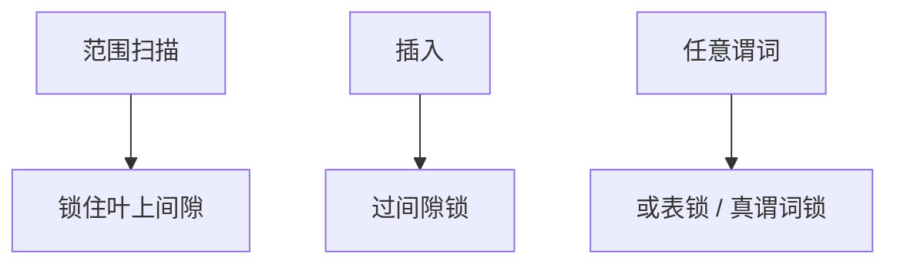

# 间隙锁与谓词锁

幻象来自范围内新插入。谓词锁锁住「满足条件的未来行」；间隙/next-key 用索引空隙近似。

<footer>—— 据 Eswaran et al. 谓词锁；InnoDB next-key；主干幻读课的锁实现</footer>

[上一课](/cs/intention-locks)把锁挂在层次上。本课不画 IX 矩阵。缺口是幻读：主干已定义；2PL 行锁锁不住「还不存在的行」。谓词锁（predicate lock）在理论上锁 $\sigma_\theta$；工程用索引间隙锁、next-key 锁近似。

## 问题

`SELECT … WHERE id BETWEEN 10 AND 20` 可重复读下，另一事务插入 id=15 会幻。谓词锁：对 $\theta$ 加锁，插入者检查新行是否满足任何活跃谓词。实现难：谓词任意、相交判定贵。间隙锁：在 B+ 叶上锁 (10,20) 之间的间隙，插入必须过间隙锁。next-key：间隙+记录，避免幻与丢失更新的组合缝。

无索引：可能退回表级锁。这是计划与并发的耦合——没有合适索引，可串行更贵。

Eswaran, Gray, Lorie, Traiger，CACM 1976 事务一致与谓词。InnoDB REPEATABLE READ 实际用 next-key，与标准 RR 不完全同。本课机制。

## 方法

扫描带索引条件则对碰到的间隙加锁（隔离级别够高时）。插入：定位叶，检查间隙冲突。哈希索引无序，间隙难定义，幻象保护弱或表锁。OCC/SSI 用读范围记录代替间隙锁。

死锁：间隙锁与行锁互相等待，wait-for 要包含它们。

## 机制

性能：范围越大锁越多，并发下降。这是「可串行的税」。覆盖扫描仍要锁间隙，不只盖列。分区：间隙在分区内，跨分区插入要各间隙或更粗锁。

与 MVCC：快照读可避免部分幻，写偏斜与插入幻仍要 SSI 或间隙。Postgres RR 用快照，serializable 用 SSI，间隙模型与 InnoDB 不同。

## 边界

本课不画 wait-for 算法。也不把间隙当空间 R 树锁。谓词完全一般不可判定相交，工程必近似。

后课默认：防幻要锁范围或记谓词；无索引则粗锁。wait-for 图：检测锁等待环。

间隙是索引序上的谓词近似，不是 SQL 谓词的完备实现。

## 小结

- 谓词锁理论防幻；间隙/next-key 用 B+ 空隙实现。
- 无序索引与无索引使保护退化。
- wait-for 图下一课：死锁检测。
- 出处：Eswaran et al. 1976；InnoDB next-key；Gray and Reuter。
