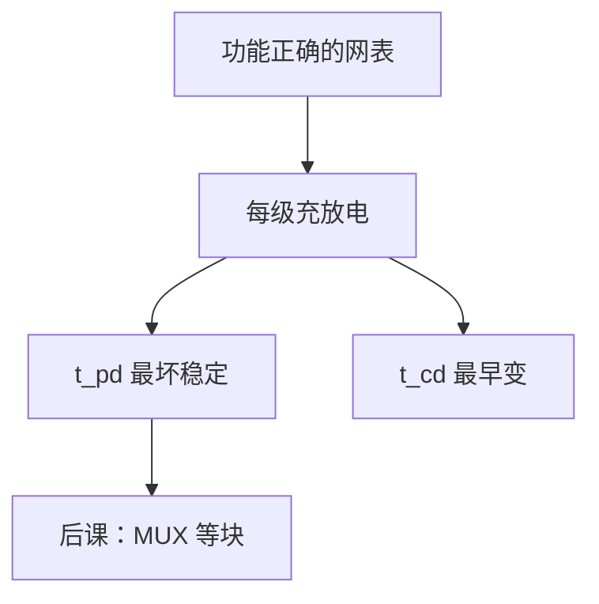

# 组合逻辑时延

功能对了还不够：输出必须在最坏输入变化后的某个时刻才稳定，那个时刻就是传播延迟。

<footer>—— 据 Harris and Harris, Digital Design and Computer Architecture 整理</footer>

上一课[传输门与三态](/cs/transmission-tristate)钉死了任意组合功能都能落成门网。本课不重证 NAND 完备，也不从电磁场另起。缺口是：卡诺图与布尔式都不含时间。CMOS 对电容充放电需要时间；后课时钟周期不能短于这段时间。

## 问题

网表在直流上实现 $f$。输入同时变，输出要经过若干级才到新值，途中可以有[险象课](/cs/dont-care-hazard)的毛刺。缺口因此不是新门，而是两个数：$t_{pd}$ 传播延迟（最坏稳定时间）、$t_{cd}$ 污染延迟（最早可能变）。时序约束用前者定周期下界，用后者防保持时间失败——保持是[建立保持](/cs/setup-hold)的缺口，本课先把组合块当成有延迟的盒子。

关键路径是拓扑上延迟之和最大的那条。本课用单位门延迟作加法模型，不把 RC 树 Elmore 公式写完。

### $t_{pd}$ 不是仿真里「看起来稳了」的一次波形

必须对输入对、温度、工艺角取最坏。功能仿真通过不等于时序通过。把扇出当成免费，关键路径会少算几级反相器缓冲。

Harris 把组合逻辑画成带 $t_{pd}$/$t_{cd}$ 的云。后课单周期 CPU 的周期就是最长指令的组合路径。本课不引入触发器。

## 方法

每级门赋延迟（可按扇入扇出加权）。$t_{pd}(\mathrm{path})=\sum t_{pd,i}$，电路 $t_{pd}$ 取全体输入-输出路径最大。污染延迟取最小。多级化简可能减逻辑深度，但扇出变大，延迟不一定降——与卡诺图「项更少」不是同一目标。

## 机制

后课加法器的行波进位 $t_{pd}$ 随位宽线性涨，才有超前进位。MUX、ALU 都先当组合云，用本课的尺子比深度。时钟仍未进场：组合电路没有「周期」，只有从输入变到输出稳的时间。

险象的毛刺落在 $t_{cd}$ 与 $t_{pd}$ 之间。若下游是纯组合，毛刺继续走；若下游是边沿采样，要看是否落在窗口外。

## 边界

本课不讲时钟树、不讲互连铜线上的飞行时间作为主模型（承认线电容折进门负载即可）。不把异步组合反馈（环振）当合法数字设计——那是有意的模拟/测试结构。

后课默认：每个组合块带 $t_{pd}$、$t_{cd}$；关键路径决定后课能跑多快。

## 小结

- 组合正确性之外必须计量 $t_{pd}$ 与 $t_{cd}$。
- 关键路径是最坏延迟和；项数少不等于深度小。
- 时钟与触发器仍未出现；本课只给组合盒子贴时间。
- 出处：Harris and Harris。
