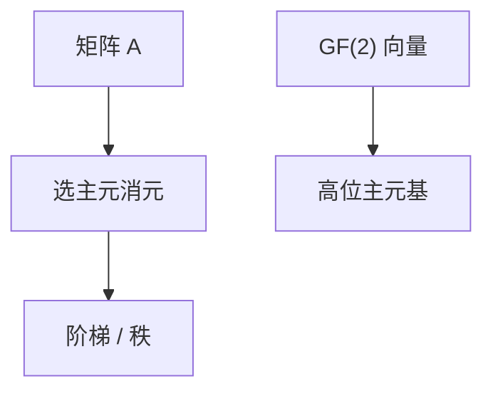

# 高斯消元与线性基

行变换把矩阵变成阶梯：解线性方程组、求秩；$\mathrm{GF}(2)$ 上同一过程给出线性基，能插、能问最大异或。

<footer>—— 据 CLRS 第 28 章；线性基为竞赛与编码教材标准技法整理</footer>

上一课[Strassen](/cs/strassen)谈乘的渐近。解 $Ax=b$ 要消元，不是乘。缺口是高斯消元：$O(n^3)$ 行操作，以及 $\mathbb{F}_2$ 上把向量插入基。不重写矩阵幂。后课单纯形在不等式上走顶点。接[有限域](/cs/finite-field-gf2n)只当系数域，不重写不可约多项式。

## 问题

域上 $n\times n$：选主元，消列，回代。秩、行列式（对角积）、逆（增广单位阵）同一套。无主元则奇异。数值上要选主元抗舍入。$\mathrm{GF}(2)$：加即异或，插入：从高位扫，有主元则异或掉，否则占坑。询问：贪心从高位能否变大。

缺口是行空间基底，不是最大流。

### 线性基不是最小生成树

都「插入不相关的」，但一个在向量空间，一个在图切分。不要用并查集当异或基。

CLRS 28 高斯。主元选择见数值分析（Golub–Van Loan 点名）。线性基是高斯在 $\mathbb{F}_2$ 的在线形式。后课 LP 的可行域不是线性方程组。

## 方法

方程组：消元 + 回代，$O(n^3)$。多组 $b$ 可一起。线性基：最多 $w$ 个主元（位宽 $w$），插入 $O(w^2)$ 或 $O(w)$ 视实现。

模 $p$ 消元用逆；模合数不是域。

## 机制

行变换不改变解集（或改已知的等价）。$\mathbb{F}_2$ 上线性无关 = 不能异或出零的非空子集。最大异或是基向量按位贪心，正确因高位确定后低位正交补。与高斯：$n$ 个向量插入即消元过程。

## 边界

本课不写 SVD、不写病态数全文。稀疏消元填入另论。后课默认：域上线性方程组高斯；$F_2$ 线性基在线。下一课单纯形：不等式与目标。

## 小结

- 高斯：$O(n^3)$ 解方程、求秩。
- $\mathrm{GF}(2)$ 线性基插入与最大异或。
- 要域；选主元为数值。
- 出处：CLRS 第 28 章。
