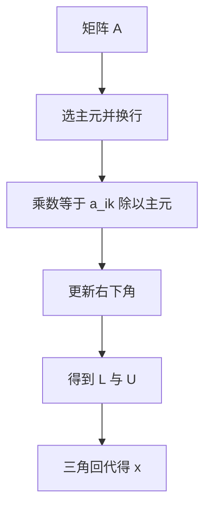

# 高斯消元与主元

消元用当前列的主元去除下面的行；主元过小则乘数过大，舍入被放大，交换行是在选一个后向更稳的消去顺序。

<footer>—— 据 Golub and Van Loan, Matrix Computations；Trefethen and Bau, Numerical Linear Algebra；Higham, Accuracy and Stability of Numerical Algorithms 整理</footer>

上一课[求和顺序](/cs/summation-order)说明结合律失败时顺序即算法。本课不重讲 Kahan，也不从行列式公理另起。缺口是：线性方程 $Ax=b$ 的消去是一长串乘加与减法，**没有主元策略时，一次除以过小的对角元就会把前面的 $\gamma_n$ 与抵消同时放进来**。这是「线性与根」课序的第一课。

## 问题

高斯消元把 $A$ 变成 $PA=LU$（带行交换时）。每步用主元除该列下方，得到乘数，再从下面的行减去倍数。缺口因此不是「如何用手算 3×3」，而是**主元选择属于稳定性**：部分主元在当前列选绝对值最大者，避免乘数超过 1 的量级。完全主元还看后面的列，代价更高。无主元时，即使 $A$ 可逆且良态，算法也可以不稳定。

求和课的「谁先加」在这里变成「哪一行当主元」。两者都是在浮点里选结合与缩放的顺序。本课只钉部分主元的动机；增长因子的最坏指数界是理论边角，实践中部分主元对多数矩阵够用。

### 主元不是「让对角元非零就行」

精确算术里，非零即可继续（必要时换行避免恰好为零）。浮点里「几乎为零」比恰好为零更危险：乘数巨大，一行被另一行的舍入噪声淹没，后向扰动 $\Delta A$ 不再是 $O(u)\|A\|$。把主元理解成「跳过零」会在近奇异或缩放差的列上翻车。行缩放、列缩放会改变「谁最大」，选主元前要先问范数是否可比。

Golub and Van Loan 把 GEPP 写成标准分解。Trefethen and Bau 用增长因子解释为何部分主元几乎总是稳定。Higham 给出后向误差与残量的关系。本课不把稀疏消元的填入展开。

## 方法

第 $k$ 步：在 $k:n$ 行的第 $k$ 列选最大绝对值，换行，除法得乘数，秩一更新右下角。回代解三角系，三角解本身通常后向稳定。选主元的比较是数据依赖的控制流，不能当成与 $A$ 无关的固定顺序。

残量 $b-A\hat x$ 小支持后向稳定的叙事，不保证 $\hat x$ 接近 $x$——那要乘[条件数](/cs/condition-number)。下一课才把 $\kappa(A)$ 用矩阵范数写严。

列主元不对称：它不交换列，因此不改变未知量顺序，实现简单。完全主元改变变量顺序，要记录列置换才能还原 $x$。实际稠密密集问题里部分主元几乎总够；刻意构造的增长反例存在，但不应当把它们当成拒绝 GEPP 的理由。实现还要注意：比较绝对值时要把已更新的元素拿来比，而不是用原始 $A$ 的副本，否则选的不是当前消去步骤真正用到的主元。

## 机制

乘数有界则更新里的乘加接近普通内积的 $\gamma_n$ 图像。主元过小等于把一行放大再去减，噪声被放大，等价于给 $A$ 一个不小的 $\Delta A$。交换行不改变精确解（对 $b$ 同步交换），只改变浮点路径。这与灾难抵消相同：代数等价，数值不等价。增长因子刻画 $|U|$ 相对 $|A|$ 能长多少；部分主元把它在实践中按住。

部分主元对付的是算法注入，不降低 $A$ 的 $\kappa$。近奇异矩阵上，即使 GEPP 后向稳定，解也可以没有一位正确——扰动课会把这句话写成定理。选主元带来的行交换必须同时作用于 $b$（或保存置换再作用于右端），否则 $LU$ 与原问题对不上。对 SPD 矩阵，Cholesky 无主元在精确算术里稳定得多，因为结构挡住了增长；这不是「所有矩阵都可以不选主元」。稀疏矩阵的主元还要跟填入权衡，本课只取稠密默认：先稳，再谈稀疏策略。

## 边界

本课不讲 Cholesky 对 SPD 的无主元合法性，只点名：结构可以代替选主元。下一课[矩阵范数与扰动](/cs/matrix-norm-perturb)给 $\kappa(A)$ 与扰动定理。后课默认：GE 必须带主元策略；部分主元是默认稳定手段；残量小不等于解准。

## 小结

- 消元顺序由主元决定；过小主元放大舍入。
- 部分主元限制乘数，追求后向稳定的 $LU$。
- 行交换不改精确解，改变浮点路径。
- 下一课用范数写清 $Ax=b$ 的扰动。
- 出处：Golub and Van Loan；Trefethen and Bau；Higham。
