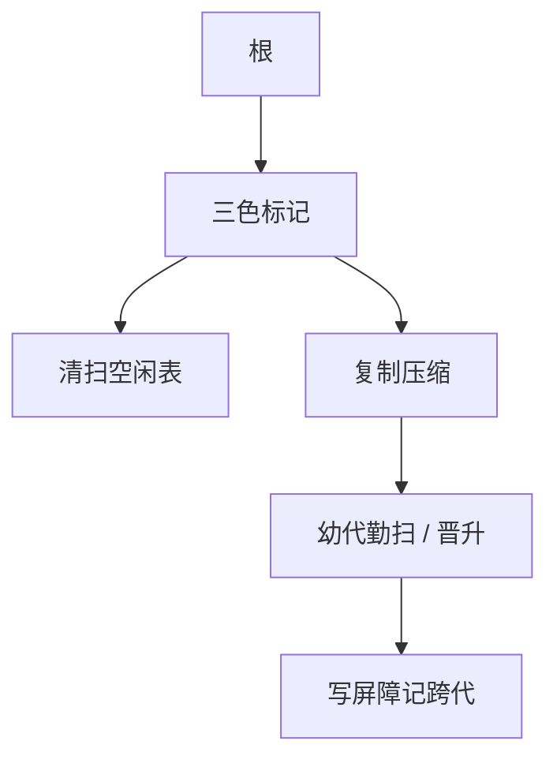

# 标记清除与分代

追踪式回收先从根标记可达，再清未标记或把活对象搬到新半区；分代假设新对象早死，平时只扫幼代，老到老代靠写屏障记录跨代指针。

<footer>—— 据 McCarthy, 1960；Ungar, Generation Scavenging, 1984；Jones, Hosking and Moss, The Garbage Collection Handbook 整理</footer>

上一课[运行时与 GC 直觉](/cs/runtime-gc)给出堆、根、可达即活，并点名标记-清扫、复制、分代。本课不重定义根。缺口是三种算法怎么走完、碎片与写屏障各自补哪块洞。异常表下一课才处理非局部跳出；本课仍停在堆。操作系统课从内核门再问虚拟内存从哪来。

## 问题

标记-清扫：着色（三色抽象）从灰根推进，黑为活，白为死；再扫堆把白链进空闲表。碎片：反复清扫留下洞，分配要找合适块或整理。复制式：from/to 半区，活对象 bump 到 to，指针更新，from 整区丢弃——自动压缩，空间折半。缺口是在直觉之后把步骤钉死，不是再解释 `malloc`。

分代：幼代用复制（小、回收勤），活过几次晋升老代；老代少扫。跨代指针：老对象指向新对象时，幼代回收必须把该指针当额外根。写屏障：每次堆写检查并记入 remembered set。无屏障会漏标或错收。

### 写屏障不是内存模型的 fence

[内存一致性](/cs/memory-consistency) 的屏障管可见性。GC 写屏障是编译器插入的「记一笔跨代」，可以很弱（卡片标记）。不要把 MESI 请进来。

McCarthy 标记回收。Ungar 1984 分代清扫。Jones 等手册分章。Dijkstra 等三色不变式点名：并发 GC 靠屏障维持，本课以 STW 为默认。

## 方法

分配：空闲链表或 bump。STW 标记-清扫或复制。分代：分配进幼代；满则幼代复制，晋升阈值按年龄。编译器在指针写处插屏障（分代/增量才必须）。

[图遍历](/cs/bfs-unweighted) 在堆图上；指针识别仍须编译器合作（栈图 vs 保守）。

## 机制

暂停时间：全堆标记随活对象涨；分代把常见暂停压到幼代。吞吐：屏障与复制搬迁的代价。实时性仍不保证，本课不写 Metronome。循环引用：追踪式可收；引用计数要单独处理，点名不展开。

不要在无根登记的情况下把指针藏进非指针位型。安全点：GC 只在可枚举寄存器的位置切入。

## 边界

本课不写内核分配器、不写页表。并发漏标只点三色。后课默认：分代 + 写屏障是托管语言的常见实现。非局部控制（throw）要沿栈拆帧并调析构，对象仍须可枚举——下一课异常表。

## 小结

- 标记-清扫留碎片；复制压缩但半区。
- 分代依赖早死假设与写屏障。
- STW 默认；并发是屏障加强。
- 出处：McCarthy, 1960；Ungar, 1984；Jones, Hosking and Moss。
