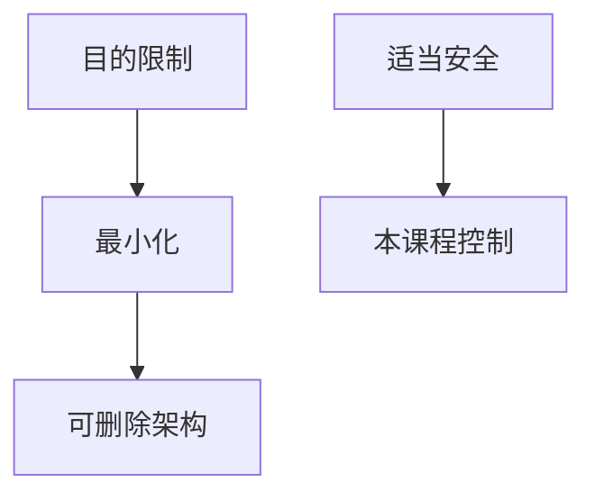

# GDPR 的技术含义

GDPR 把个人数据的合法基础、目的限制、最小化、删除权写成义务。技术含义是：访问控制、留存、可删除架构、跨境、记录处理活动——不是贴合规徽章。

<footer>—— Regulation (EU) 2016/679；对照 Article 29/EDPB 对技术措施的意见点名</footer>

## 定位

上一课[k-匿名](/cs/k-anonymity)常被误当成合规完成。缺口是**法律义务如何落到系统**：最小化、目的、删除、安全适当。本课技术含义，不是法律咨询。

后课默认已经读完本课钉下的合同，只补差，不从该领域第一性原理重开。

## 问题

日志与备份让删除权变难。缺口是：数据图、加密与密钥销毁、留存工作流。

### 适当安全

第 32 条指向风险相应的技术。回到本课程的合同，而不是买一张证书。

GDPR 正文。脱敏下一课是最小化的工程手段。

## 方法

列：合法基础记录、最小化字段、删除传播、违约通知时间。下一课脱敏与令牌化。

图中节点是本课的机制骨架；课程不把图展开成可运行的攻击步骤。

## 机制

法律把隐私当义务。令牌化下一课减少明文持有。

前提写进合同之后，游戏外的误用只当失败模式点名，不在本课写成操作程序。

## 边界

不提供规避法律的建议。脱敏与令牌化下一课。

## 小结

- k-匿名不是 GDPR 完成。
- 最小化、目的、删除要架构支持。
- 适当安全指向已讲控制。
- 下一课脱敏与令牌化。
- 出处：Regulation (EU) 2016/679。
