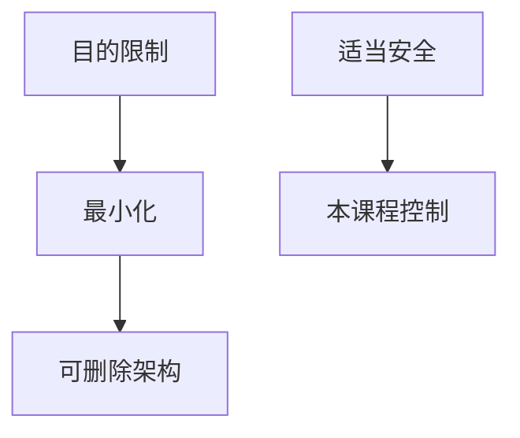

# GDPR 的技术含义

GDPR 把个人数据的合法基础、目的限制、最小化、删除权写成义务。技术含义是：访问控制、留存、可删除架构、跨境、记录处理活动——不是贴合规徽章。

<footer>—— Regulation (EU) 2016/679；对照 Article 29/EDPB 对技术措施的意见点名</footer>

## 定位

上一课[k-匿名](/cs/k-anonymity)常被误当成合规完成。缺口是**法律义务如何落到系统**：最小化、目的、删除、安全适当。本课技术含义，不是法律咨询。

后课默认已经读完本课钉下的合同，只补差，不从该领域第一性原理重开。

## 问题

日志与备份让删除权变难：备份按恢复点成块复制，日志为排障与审计留存、与隐私删除相抵，派生数据（缓存、特征表、训练过的模型）散在管线各处。第 17 条删除权落到工程就是「删除要能传播」。缺口是：数据图、加密与密钥销毁、留存工作流。

### 适当安全

第 32 条指向风险相应的技术，假名化与加密被点名为示例措施；恰当性按数据敏感度与规模定档，不是买一张证书。回到本课程的合同：访问控制、加密、审计就是这条的技术库存。

GDPR 正文。脱敏下一课是最小化的工程手段。第 33 条：知悉违约后 72 小时内报监管；第 30 条要记录处理活动（RoPA）；Recital 26 下假名化数据仍是个人数据。

## 方法

把义务翻译成工单：第 6 条合法基础逐用途登记，同一字段不同用途可不同基础；第 5 条最小化收字段，收集时只留必需列；删除传播先画数据图——主库、只读副本、缓存、数仓、[备份](/cs/backup-pitr) 各有方案；72 小时违约通知要求告警到法务的路径预先演练；跨境按目的地与传导工具（充分性认定、SCC）区分。列：合法基础记录、最小化字段、删除传播、违约通知时间。下一课脱敏与令牌化。

```mermaid
flowchart TD
  PURP["目的限制"] --> MIN["最小化"]
  MIN --> DEL["可删除架构"]
  SEC["适当安全"] --> CTRL["本课程控制"]
```

图中节点是本课的机制骨架；课程不把图展开成可运行的攻击步骤。

## 机制

法律把隐私当义务，工程问题变成作用域控制：每用户数据密钥（DEK）封装其数据，主库删除时销毁 DEK，散落在不可变存储（备份、日志、对象存储）里的密文随之不可解——crypto-shredding；前提是该类数据全走这条封装。备份的折中：保留期内不解剖已删用户，恢复时按删除清单过滤重建。留存按字段定 TTL，物理删与逻辑删分开。第 25 条「设计与默认」就是最小化进默认配置，与加固课同构。令牌化下一课减少明文持有。

前提写进合同之后，游戏外的误用只当失败模式点名，不在本课写成操作程序。

## 边界

不提供规避法律的建议。k-匿名不是完成态（回上一课），本课给的是义务到工单的翻译，不是合规结论。脱敏与令牌化下一课。

## 小结

- k-匿名不是 GDPR 完成。
- 最小化、目的、删除要架构支持。
- 适当安全指向已讲控制。
- 下一课脱敏与令牌化。
- 出处：Regulation (EU) 2016/679。
