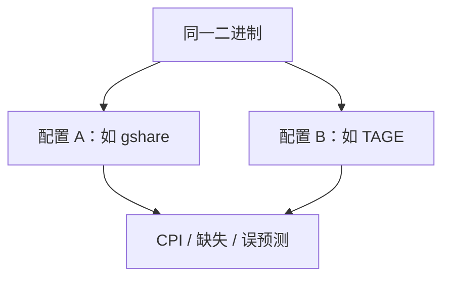

# gem5 与微结构模拟

周期级模拟把 ROB、IQ、cache、NoC 变成可改的旋钮；换的是速度与绝对频率不准，换来的是对照实验：只改 TAGE 表项看 CPI。

<footer>—— 据 Binkert et al., The gem5 Simulator, ACM CAN 2011 整理</footer>

[上一课](/cs/roofline-model) 需要可信的 $F$ 与 $B$。[PMU](/cs/pmu-counters) 在真机上快，但旋钮不可任意拆。[SPEC 陷阱](/cs/spec-benchmark-pitfalls) 在模拟里同样存在，且更易「只跑一小段」。本课缺口是 **gem5：事件驱动的全系统/系统调用模拟，用来做本课序结构的消融。**

## 问题

真机不能把 [发射宽度](/cs/issue-queue-wakeup) 从 4 改成 8 而保持其余不变。RTL 太慢。缺口是**在 C++ 模型里实现流水线与存储层次，用同一检查点比较两种预测器。** gem5 是当代教学与论文常用的这一层，不是唯一模拟器。

Binkert 等描述 gem5 对 M5 与 GEMS 的合并：CPU 模型（Simple、O3）+ 存储（Ruby 等）。绝对 IPC 与硅有差距；排序（A 比 B 好）更可信，仍要校准。

## 方法

选 CPU 模型：功能级快、O3 才有 ROB/IQ/LSQ。挂 cache、预取、可选 Ruby 一致性。跑同一 binary 与输入，dump 误预测、缺失、MLP。对照本课序：改 gshare 历史位、RRIP 插入、目录 vs 窥探。

## 机制

模拟器自己的 [Roofline](/cs/roofline-model) 必须用模型里的带宽，不能抄产品手册当硅。Warmup：丢掉冷 cache 段，否则与 SPEC 短跑陷阱同类。全系统模式才看 OS [TLB shootdown](/cs/tlb-shootdown)；syscall 模式更快但不含内核。可靠性下一课：模拟通常假定无软错误，MTTF 要另加故障模型。

采样（SimPoint 一类）用代表性区间代替全程序，否则 O3 模型跑 SPEC 要以天计。区间选错会让「TAGE 赢 gshare」变成那段热循环的性质，而不是整程序。

## 边界

本课不教安装与命令行。也不把 FPGA 原型当 gem5 的替代公式——更快更准、更贵。Spectre 课会警告：模拟器若无时序 cache 模型就看不到侧信道，那是安全与模型保真的交叉。

后课默认：结构消融用周期级模拟；硅上的错误率用 MTTF 与冗余另算。

## 小结

- gem5 一类模拟器用可重复旋钮解释 CPI 来源。
- 绝对数要校准；短 warmup 会骗人。
- 故障与冗余是下一课 MTTF。
- 出处：Binkert et al., *ACM CAN*, 2011。
