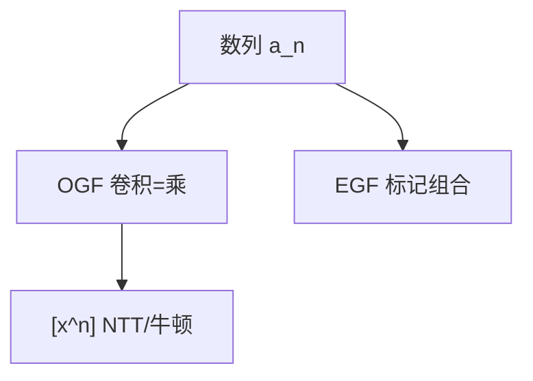

# 生成函数

数列 $\{a_n\}$ 收成 $\sum a_n x^n$；卷积变乘法，线性递推变有理函数，计数变成多项式运算。

<footer>—— 据 Wilf, generatingfunctionology；Knuth TAOCP 卷 1；Flajolet and Sedgewick, Analytic Combinatorics 整理</footer>

上一课[Lucas 定理](/cs/lucas-theorem)给了模 $p$ 的 $\binom n m$。普通生成函数（OGF）在形式幂级数里把卷积当乘。缺口是这套**字典**：加法、乘、复合，以及 $1/(1-x)$、$\exp$ 的指数生成函数（EGF）点名。不重写 NTT 实现。后课莫比乌斯反演是数论卷积，可视为狄利克雷生成函数。

## 问题

OGF：$A(x)=\sum a_n x^n$。两独立选取的方案卷积 $\Leftrightarrow A(x)B(x)$。Catalan、划分、背包个数都是乘与 $[x^n]$。EGF：$\sum a_n x^n/n!$ 适合标记组合、集合、排列。线性递推 $\Leftrightarrow$ 有理生成函数，部分分式给通项。

缺口是翻译，不是把 FFT 再讲一遍。提取 $[x^n]$ 用 NTT 乘或牛顿（上一单元）。

### 形式幂级数不是分析课

半径、奇点分析（Flajolet）给渐近，本课点名。算法课先当多项式截断。不要一上来留数。

Wilf 的书是组合生成函数入门。Knuth 用生成函数分析算法。后课 $\mu$ 反演是另一卷积（除数格）。

## 方法

列状态或组合分解，写出 $A(x)$ 方程，解或牛顿求系数。需要前 $n$ 项则截断乘。模素数时全程 NTT。

背包：$\prod(1+x^{w_i})$ 或无限 $\prod 1/(1-x^{w_i})$。

## 机制

卷积定理在形式级数是定义。线性递推的特征多项式与分母相同。与矩阵幂：有理 OGF 的系数仍可用伴生矩阵，两套语言。与 DP：生成函数是批量 DP。

## 边界

本课不写奇点分析全文。不写对称函数。后课默认：卷积计数优先生成函数 + NTT。下一课莫比乌斯反演。

## 小结

- OGF 乘 = 卷积；EGF 管标记。
- 线性递推 $\leftrightarrow$ 有理函数。
- 系数用已有多项式算法。
- 出处：Wilf；Knuth TAOCP；Flajolet–Sedgewick。
