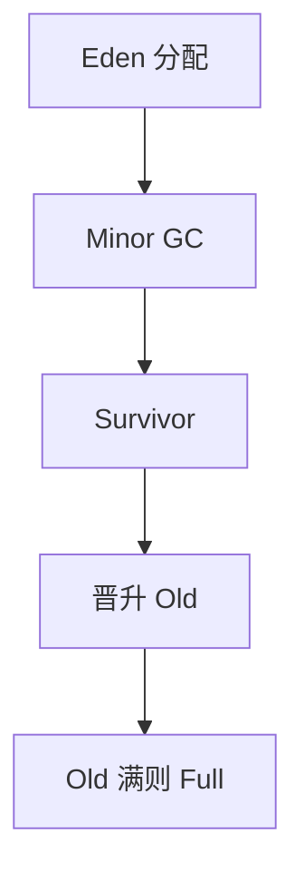

# 分代假设与晋升

多数对象朝生夕死。幼代频繁复制，活过几次的晋升到老年代，老年代少扫。写屏障记住老到幼的指针。

<footer>—— 据 Lieberman and Hewitt, A Real-Time Garbage Collector Based on the Lifetimes of Objects；Ungar；主干[标记清除与分代](/cs/gc-mark-gen) 整理</footer>

上一课[并发 GC](/cs/concurrent-incremental-gc) 管停顿形态。主干分代已点名。缺口是**晋升策略**：年龄、survivor 空间、老年代满了 Full GC。本课钉假设与失败模式（晋升失败），bump 分配下一课。

## 问题

复制半区若当全堆，长命对象反复搬。分代：Eden + survivor，满了后活对象年龄+1，超阈值进 Old。缺口是**何时晋升**，不是三色证明。

分代假设对某些负载失败：缓存对象全长命，幼代收集几乎不收，只晋升——吞吐量崩。

### 晋升不是「对象变类型」

仍是同一对象，只是区域变。身份（地址）复制式会变，须更新指针。

Lieberman–Hewitt 1983。Ungar scavenging。Appel 简单分代。主干 gc-mark-gen。

## 方法

Eden bump 分配。Minor GC：Eden+from → to，更新记忆集。年龄表。Old 用标记压缩或 CMS。

与逃逸：未逃逸不进 Eden，减 minor 压力。

## 机制

晋升失败：Old 不够，退化 Full，停顿尖峰。并行 scavenge。不要把所有大对象直接 Old 当唯一策略而不测。

弱引用在分代下要特殊队列，后课。

## 边界

本课不写 TLAB。后课默认：幼代复制+晋升。下一课 bump 分配与 TLAB。

也不把分代当人口统计学课。

## 小结

- 分代假设：新对象易死；晋升保护长命对象。
- 写屏障 + 记忆集使 minor 正确。
- 假设失败则 minor 无益。
- 出处：Lieberman and Hewitt；Ungar；Jones 手册；主干 gc-mark-gen。
