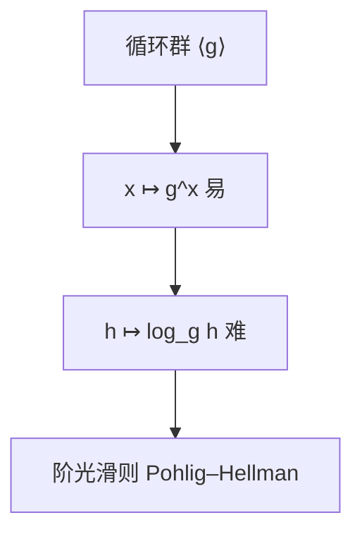

# 生成元与离散对数

循环群 $G=\langle g\rangle$ 里，已知 $g,g^a$ 求 $a$ 叫离散对数。正向模幂易，反向在谨慎选择的群里难——DH 停在这一不对称上。

<footer>—— 据 Diffie and Hellman, 1976；Ireland and Rosen 整理</footer>

上一课[GF(2ⁿ)](/cs/finite-field-gf2n) 给出有限域。缺口是乘群的**循环生成元**与 DLP。主干[DH](/cs/diffie-hellman-paper) 已用 $g^a,g^b$；本课钉：何谓生成元、阶、安全子群，不重做密钥交换报文。

## 问题

有限域乘群循环：存在 $g$，$\mathrm{ord}(g)=q-1$。$g$ 生成元（原根）。$\log_g h$ 是 $g^x=h$ 的 $x$。Baby-step giant-step $O(\sqrt{|G|})$，Pohlig–Hellman 把阶分解成小素因子——故 $|G|$ 要有大素因子。素数域 $\mathbb{F}_p$ 选安全素数 $p=2q+1$，或用大素子群。椭圆曲线上同样定义 DLP，群运算不同，后课。

OWF 课：模幂（固定 $g$）是候选单向；陷门不在 DH，在 RSA。

### 不是「对数表」

实数 $\log$ 连续可算。DLP 在离散循环群，没有单调可用的牛顿法。指标演算对 $\mathbb{F}_p$ 亚指数，对椭圆曲线一般不适用——这是 ECC 参数更短的原因，后课点到即可。

Diffie–Hellman 1976。Shoup 的下界在泛型群。Ireland–Rosen 原根存在性（模 $p$）。本课不证存在性全部情形。

## 方法

在 $\mathbb{F}_7^\times$ 找生成元，列幂表当「玩具 DLP」。说明 Pohlig–Hellman：阶光滑则易。对照扩展欧几里得：那是加群 $\mathbb{Z}/n\mathbb{Z}$ 上的「对数」（乘法逆），多项式；乘群上不是。

## 机制

DH 的机密是 $g^{ab}$，被动者看见 $g^a,g^b$。CDH、DDH 是更细的假设。本课只要 DLP 陈述。生成元检验：对 $|G|$ 的每个素因子 $q$，$g^{|G|/q}\ne 1$。

RSA 的「对数」是对 $e$ 求 $d$，秘密是 $\varphi(n)$，不是同一问题。

检验生成元：对 $|G|$ 的每个素因子 $q$ 测 $g^{|G|/q}\neq 1$。安全素数 $p=2q+1$ 使阶只有因子 $2,q$。DDH：$(g^a,g^b,g^{ab})$ 与 $(g^a,g^b,g^c)$ 不可分，比 CDH 更强，许多协议真正用 DDH。本课 DLP 足够解释「正向易反向难」。

## 边界

本课不写指标演算，不选具体 RFC 素数。不引入双线性对。后课默认：循环群上正向幂易、DLP 要硬，则阶不可光滑。下一课二次剩余。

循环群上幂易、对数难，是 DH 的全部不对称。阶光滑则 Pohlig–Hellman 拆开它。RSA 的「求 $d$」靠 $\varphi(n)$ 秘密，不是同一问题。ECC 后课换群、同形 DLP。

上一课留下的缺口在本课收口；「生成元与离散对数」进入后课词汇表后只引用。文献用来钉对象与边界，不把本课写成该主题的独立综述。

## 小结

- 有限域乘群循环；生成元的幂覆盖全体非零。
- DLP：已知 $g^a$ 求 $a$；光滑阶则易。
- DH 建立在此不对称上，本课不重做协议。
- 出处：Diffie and Hellman, 1976；Ireland and Rosen。
