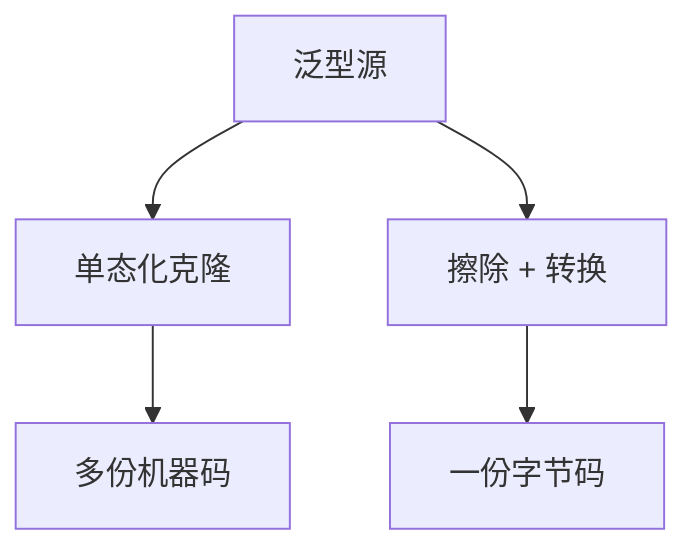

# 泛型：单态化对擦除

同一套多态源，可以按类型参数复制出特化机器码，也可以擦掉参数只留一份代码。二者对身份、特化与二进制大小的答案相反。

<footer>—— 据 Pierce TAPL 对 System F 的阐述；Bracha 等 Java 擦除设计；Rustonomicon / Appel 对特化的讨论整理</footer>

上一课[子类型与变型](/cs/subtyping-variance)允许 `List<Dog>` 与 `List<Animal>` 发生关系（或拒绝）。缺口是**实现**：编译器把 $\forall$ 或泛型类怎么降到无类型 IR。[算法 W](/cs/hindley-milner-w) 的方案在表面；后端要单态化（C++/Rust）或擦除（Java）。本课钉权衡，不重写链接器。

## 问题

单态化：`id<int>` 与 `id<string>` 两份代码，可内联、可特化布局（`Vec<u8>` vs `Vec<T>`）。代价：代码膨胀、编译时间、弱身份（两个实例不是同一函数指针）。擦除：运行时 `List` 是一份，类型参数靠强制与桥接方法；不能特化原语布局（Java 的装箱）。缺口是**这份降级选择**，不是变型规则本身。

C# 的值类型有限特化、引用类型擦除，是中间点。点名即可。

### 擦除不是「没有泛型」

静态仍检查 `List<String>` 不能 `add(Integer)`。擦的是运行时的参数。反射看见的是 raw 或残缺信息——后课反射再接。

Java JSR-14 / Bracha 的擦除。System F 的类型抽象在语义上可擦（Reynolds 抽象）。Rust 单态化是实现策略。本课不把 JIT 的投机特化写完，运行时单元再谈。

## 方法

单态化：以「泛型函数+实参类型」为键克隆 IR，再进中端。共享：相同布局可合并（后课 ICF）。擦除：插入转换、桥接；变型用通配符在静态，运行时不变。

与[内联](/cs/inlining-heuristics) 后课：单态化后的小函数更好内联；擦除后虚调用仍在。

## 机制

身份：`typeof(List<int>)` 在擦除语言里可能撞 `List<string>`。重载：擦除后签名冲突（`void f(List<A>)` 与 `void f(List<B>)`）是语言限制。单态化无此问题，但符号[mangling](/cs/name-mangling) 变长。

不要用擦除语言的数组协变去「修」特化缺失。

## 边界

本课不写模板实例化的全部 SFINAE。后课默认：泛型有两条降路。下一课类型类：与隐式参数/字典传递，常在单态化语言里特化，在 Haskell 里传字典。

也不把 C 宏当泛型实现。

## 小结

- 单态化换代码体积与特化；擦除换一份代码与装箱。
- 静态检查在两种实现上都要做。
- 运行时类型身份与重载因擦除而弱。
- 出处：Pierce TAPL；Bracha 等 Java 泛型；对照 Appel / Rust 特化实践。
