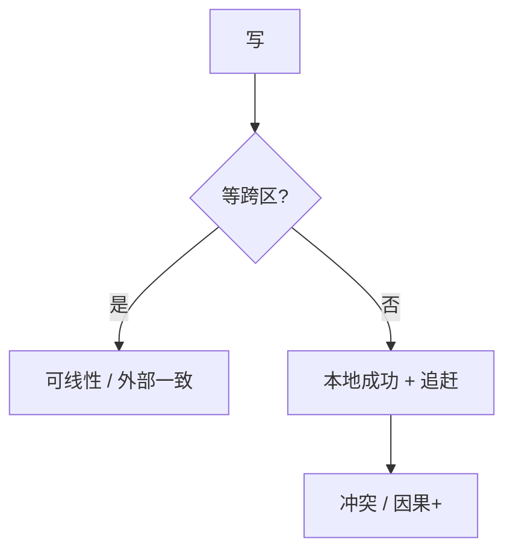

# 地理复制

跨数据中心的延迟下限是光速。同步复制买线性一致，付跨洋 RTT；异步复制买本地写，付冲突与数据丢失窗口。

<footer>—— 据 Corbett et al., Spanner, OSDI 2012；Lloyd et al., COPS, SOSP 2011；PACELC 整理</footer>

上一课[分布式 ID](/cs/distributed-id)的时间序在跨区更不可靠。缺口是**多机房同一逻辑数据**：CAP 的分区变成经常性的延迟与真切断。本课钉同步/异步地理复制与因果+，不重写 TrueTime 全部。后课滚动升级是机房内变更，可与跨区流量编排叠在一起。

## 问题

同步：写等跨区多数派，线性一致可能，延迟 ≥ RTT。异步：本地提交，对端追，RPO > 0，冲突用 LWW/CRDT/会话。COPS：在最终一致上加强因果+（读到的值的依赖都在）。Spanner：用 TrueTime 的 $\varepsilon$ 做 commit wait，给外部一致事务——依赖时钟 API，不是普通 NTP。

缺口：把「多 AZ」当地理。同城同步与跨洋异步档位不同。DNS 切流量不是 fencing。

Spanner 论文是外部一致与 TrueTime。COPS 是因果+。二者都不要缩写成「有了地理复制就强一致」。

## 方法

读本地、写本地：AP/L。写本地、读全局：看是否等复制。写全局主：一区当主，他区只读，failover 接[主备](/cs/primary-backup-failover)与脑裂。多主：必须冲突规则。

对象存储跨区复制通常异步，接 S3 课。

## 机制

分区：跨区链路比机房内更容易长时间分区。CP 系统少数派机房必须拒写。PACELC 的 EL 在无分区时仍付 RTT。时钟：跨区 $\varepsilon$ 更大，HLC 更常靠计数；TrueTime 用 GPS/原子钟把 $\varepsilon$ 暴露。

本课不写具体云厂商的 Active-Active 广告。也不写 LOB 跨区撮合。

会话：用户跟着 DNS 跳机房会破 RYW，除非把会话向量带走或粘滞。接会话保证课。

## 边界

本课不证 Spanner 并发控制。后课默认：跨区先选 RPO/RTO 与一致档；不要默认多主 LWW。滚动升级下一课处理版本异构，地理复制期间双版本更常见。TLA+ 最后课给这些协议一个规格语言。

光速是墙。协议只能把墙换成冲突或延迟，不能拆墙。

## 小结

- 同步跨区：延迟换强一致；异步：RPO 与冲突。
- COPS 因果+、Spanner 外部一致是不同档。
- 跨区分区更长，少数派必须有拒写故事。
- 出处：Corbett et al., OSDI 2012；Lloyd et al., SOSP 2011。
