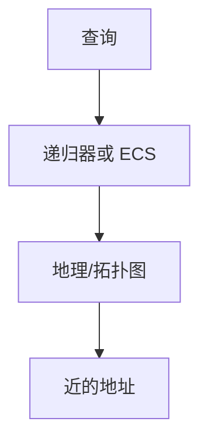

# GeoDNS

权威按解析器地址估用户位置，返回近的 A/AAAA；TTL 与缓存位置决定这份「地理」有多真。

<footer>—— 据 RFC 7871 EDNS Client Subnet；CDN 实践；主干任播课对照整理</footer>

[DNS TTL](/cs/dns-cache-ttl) 让答案被记住。[任播](/cs/anycast-edge) 是路由侧近。[上一课](/cs/doh-dot) 把递归器集中，位置更假。缺口是 **GeoDNS**：按源 IP 或 ECS 选答案。本课不把 SMTP 写完。

## 问题

全球用户打同一主机名，要近的边缘。[CDN 直觉](/cs/cdn-intuition) 已点名。权威看递归器 IP 猜用户，误差大（公共解析器）。ECS 把客户端前缀带给权威，提高精度、泄露位置。任播：同一地址，路由选近；GeoDNS：不同地址。两者常叠。RPKI 管那些地址的源 AS。

不要把 GeoDNS 写成 GPS。

RFC 7871。隐私与缓存碎片是代价。本课不点名厂商。

### 不是 GPS

按递归器或 ECS 估位置。任播是同址路由。TTL 约束切换。公共 DoH 使无 ECS 更钝。

## 方法

对照：GeoDNS / 任播 / HTTP 302。画：查询源 → 地图 → 近记录。TTL 短才能切失败节点，与缓存课衔接。DoH 大解析器使无 ECS 时更钝。

方法止于选定对象与对照；机制才说它如何嵌入已有分层与主干课。

## 机制

负载均衡后课可再在地址集合上做。BGP 劫持会把「近」变成攻击者。测量 ping 后课验证是否真近。H3 HTTPS RR 也可按地返回不同目标。

缓存：同一递归器后的多国用户共享假位置，是公共 DNS 的经典坑。

## 边界

本课不引入 IP 地理库的全部误差分析。SMTP/IMAP 是下一课。后课默认：GeoDNS 用查询源近似位置；ECS 更准更露。

把 TTL 设很长，故障切换要等过期。

上一课留下的缺口在本课收口；「GeoDNS」进入后课词汇表后只引用。文献用来钉对象与边界，不把本课写成该主题的独立综述。下一课[SMTP / IMAP](/cs/smtp-imap)。

## 小结

- 按解析器/ECS 选近地址。
- 与任播互补：一名多址 vs 同址路由。
- 公共解析器钝化地理。
- 后课只引用本课钉死的对象，不从该领域总问题重开。
- 出处：RFC 7871；CDN 实践。
