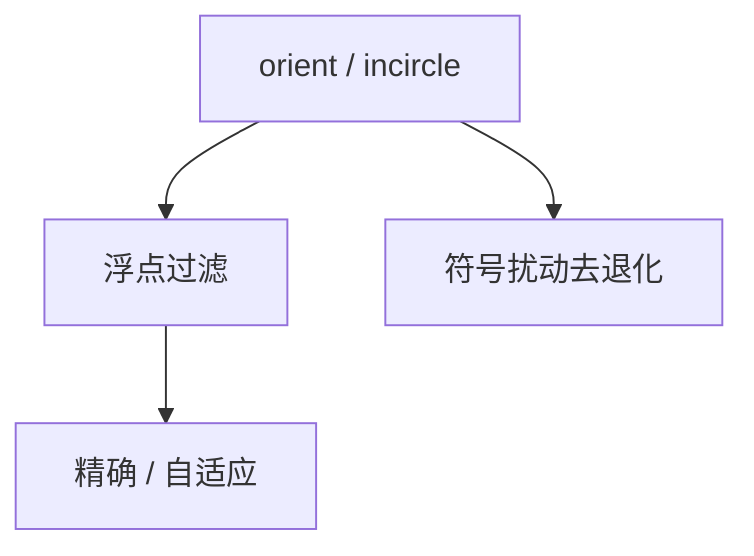

# 几何精度与鲁棒性

叉积符号判左右；浮点舍入会把「几乎共线」判错，算法拓扑崩坏。精确谓词或自适应算术才能稳住。

<footer>—— 据 Shewchuk, Adaptive Precision Floating-Point Arithmetic and Fast Robust Geometric Predicates, 1997；Yap 精确几何计算整理</footer>

上一课[点定位](/cs/point-location)假定左右判定正确。本单元几何在此收束：实现层。缺口是**谓词**：`orient2d`、`incircle` 的符号。浮点可能错号。不重写凸包栈。下一单元随机与近似。不把光刻套刻当本课。

## 问题

凸包、BO、Delaunay 都依赖谓词。错一次：凸包自交、三角非空圆。对策：整数坐标 + 精确整数叉积；自适应浮点（Shewchuk）：快路径浮点，误差界不够则精确。符号扰动（Simulation of Simplicity）去掉共线/共圆退化。

缺口是健壮，不是更快渐近。

### 不是「多加点 epsilon」

固定 $\varepsilon$ 比较会引入新不一致（$a\lt b$、$b\lt c$ 但 $a\gt c$）。要的是精确符号或一致扰动。

Shewchuk 1997 谓词。CGAL 精确核。后课 Karger 离开几何。

## 方法

优先整数输入。谓词封装，禁止散落 `double` 比较。退化用 SoS 或显式分支。过滤：区间算术快速排除。

输出坐标若需画图可再舍入，拓扑已定。

## 机制

定向符号 = 行列式符号。误差分析给出何时浮点可信。自适应只对难实例付精确代价。与 NTT：那里模精确；这里实数嵌入。与 LP：病态约束同类数值，但 LP 用主元，几何用谓词。

## 边界

本课不写完整任意精度核。不写曲面。几何课序结束。后课默认：几何算法的正确实现依赖精确谓词。下一课 Karger 最小割。

## 小结

- 拓扑正确 = 谓词符号正确。
- 自适应精确或整数核；慎用固定 $\varepsilon$。
- 退化用扰动或显式处理。
- 出处：Shewchuk, 1997。
