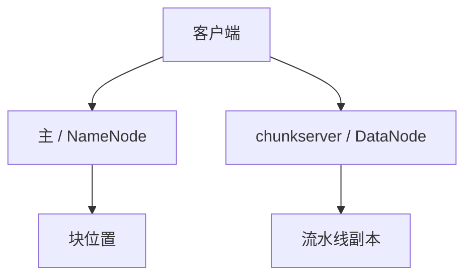

# GFS / HDFS

大文件切块，多副本放块服务器；主存元数据。主是 CP 小状态，数据面是尽力吞吐。客户端缓存块位置，租约管写。

<footer>—— 据 Ghemawat, Gobioff and Leung, The Google File System, SOSP 2003；HDFS 架构（Shvachko et al., MSST 2010）整理</footer>

上一课[混沌](/cs/chaos-engineering)把崩溃当实验。GFS 把崩溃当**日常设计点**。缺口是**大数据文件如何在普通机器上活**：不是 etcd 里放 blob。本课钉主 + 块副本。后课对象存储换 API 与一致性档。不重写 Raft 日志。

## 问题

GFS：chunk 默认 64MB，三副本。Master 管命名空间与块位置，不承运数据。客户端问主拿位置，再打 chunkserver。写：主发租约给主副本，流水线推数据，主副本排序，再数据推。主故障：有 checkpoint+操作日志，早期单主切换慢——这是[主备](/cs/primary-backup-failover)形态。

HDFS 公开实现同族：NameNode + DataNode，块报告、租约、流水线。HA NameNode 后来用共享编辑日志或独立 Journal。

SOSP 2003 强调弱一致性：追加、快照、主缓存过期。MapReduce 的输入是这种文件。本课不写 MapReduce。

## 方法

读：从最近副本读，校验和。写：租约防双写同一 chunk。主内存元数据要匹配块服务器心跳；幽灵块靠校验与扫描。

不要把主当数据面：主过载会让整个命名空间停，尽管磁盘还在。

## 机制

一致性：GFS 对并发写不保证 POSIX 全语义，保证追加的「至少一次」类记录追加（record append）可能有填充与重复——应用要容。这与[线性一致](/cs/linearizability)文件对象不同。HDFS 对打开写的文件限制更严。选档为吞吐。

与 Chubby：GFS 主选主可外包锁服务。与[链式复制](/cs/chain-replication)：流水线像短链，提交规则是租约主排序。

本课不写纠删码替代三副本的全部。也不写小文件海量的 NameNode 内存墙——下一课元数据会碰。

## 边界

本课不把 Colossus 内部当公开规格。后课默认：块存储 = 小 CP 元数据 + 大数据面副本；POSIX 语义不默认。对象存储下一课把命名空间再摊平。分布式文件元数据课专门打 NameNode 墙。

数据面可丢一台；元数据面是控制面单点，必须有自己的恢复故事。

## 小结

- GFS/HDFS：主管元数据，块服务器管字节，租约管写。
- 文件语义弱于 POSIX；为吞吐与追加。
- 主必须快照+日志；客户端缓存位置会过期。
- 出处：Ghemawat et al., SOSP 2003；Shvachko et al., MSST 2010。
