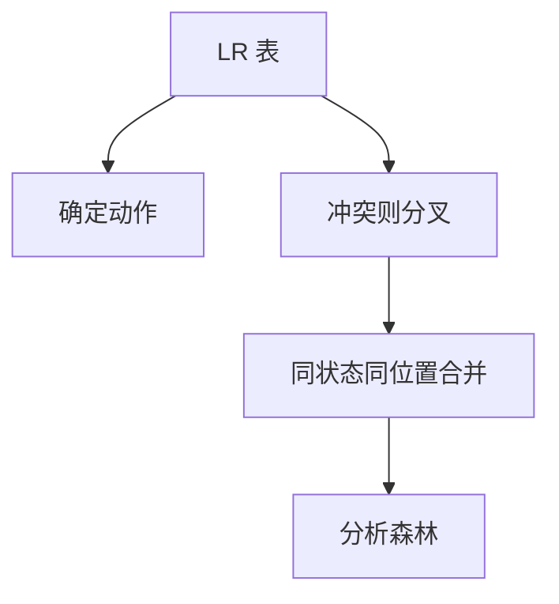

# GLR

在 LR 表遇上冲突时复制栈，沿多条移进与归约走下去；子图共享使二义文法仍可交出分析森林。

<footer>—— 据 Tomita, Efficient Parsing for Natural Language, 1986；bison 的 GLR 模式整理</footer>

上一课[Earley](/cs/earley-parser)在原 CFG 上做位置 DP，不借用已生成的 LALR 表。缺口是另一条通用路：**GLR**——确定时与 LALR 一样快，冲突才分叉。自然语言与部分程序语言（C++ 的病态局部）用这条。本课钉分叉与合并，不写 Tomita 的全部图栈细节。

## 问题

bison 默认遇冲突就选一个动作或报错。GLR：同一状态对同一记号可既移进又归约，则栈分裂；两条路若到达同一状态与同一输入位置，合并，避免指数重复。输出是共享紧凑的分析森林，而不是单棵树。缺口是**在 LR 自动机上做非确定**，不是再定义项。

相对 Earley：状态已是 LR 项集，扫描仍是查表；只在冲突格上非确定。文法接近 LR 时分叉少。

### 森林不是「随便一棵」

二义必须在语义层消：优先级、最长匹配、或类型相关再分析（C++）。GLR 只保证不丢合法推导。把森林当唯一 AST 交给类型检查会炸。

Tomita 1986。GNU bison `%glr-parser` 是工程入口。Elkhound 等实现强调合并。本课不进入自然语言统计消歧。

## 方法

生成 LR 表。确定动作则单栈；冲突则 GSS（图结构栈）上多路。归约在图上沿不同前驱弹出不同长度。共享节点：相同非终结符覆盖相同输入区间则复用。

C++ 需lookahead 与类型的交叉时，GLR 仍可能要「试探再拒」；那是语言的上下文相关，不是 CFG 的失败。

## 机制

最坏仍与一般 CFL 同阶；平均看冲突密度。reduce/reduce 在 GLR 里是合法分叉，不像 yacc 里几乎总是文法错误。内存：森林共享失败会爆。

与 PEG 后课对照：GLR 认真正的 CFG 并集；PEG 的 `/` 是有序选择，不是并。不要把 bison 的 GLR 模式当成 PEG。

## 边界

本课不把 GLL 写完，不算 Tomita 与 Earley 的常数比。不处理增量。后课默认：冲突可分叉的 LR 叫 GLR；下一课换形式体系——PEG 与 packrat，不再用产生式并。

错误恢复在多栈上更难，后课单独收。此处假定输入合法或失败则整片拒。

## 小结

- GLR：LR 表 + 冲突分叉 + 栈合并。
- 输出森林；消二义在语义，不在表的 `%left`  alone。
- 近 LR 时便宜，真二义时换空间。
- 出处：Tomita, 1986；bison GLR；对照 Earley, 1970。
