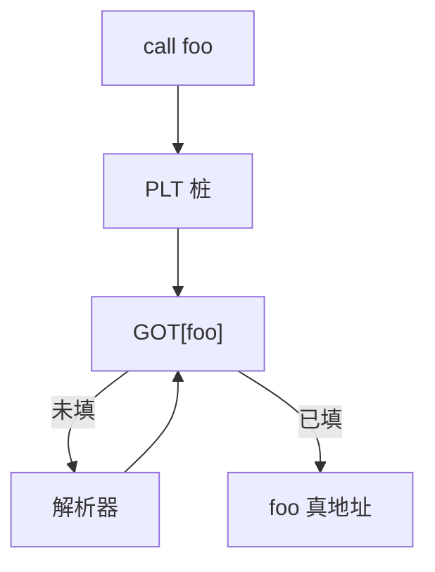

# GOT 与 PLT

GOT 是可写的地址表；PLT 是每符号一小段桩，第一次跳进解析器，以后经 GOT 直达。延迟绑定把重定位从加载时刻挪到首次调用。

<footer>—— 据 System V ABI；ELF 规范；Levine, Linkers and Loaders, 2000 整理</footer>

上一课[链接与重定位](/cs/link-reloc)把多个 `.o` 合成可执行或共享对象，并声明 PLT/GOT 的运行时跳板不在那一课。PIC 已要求外部访问走间接。本课不重做节合并。缺口是两张表的形状：GOT 条目存绝对地址；PLT 条目是可执行桩。加载器下一课才 `mmap` 并把延迟绑定跑起来；本课把编译/链接产物侧钉死。

## 问题

共享库里 `call printf` 在链接期不知道 `printf` 的最终虚址，且每个进程基址不同。GOT：链接器为符号分配槽，代码 `load t, GOT[printf]; jalr t`。启动时动态链接器填槽。若每个调用都走解析，启动慢。PLT：桩先 `jmp *GOT[printf]`；槽的初值指回桩的解析路径，解析器写完 GOT 再跳到真 `printf`。之后 GOT 已是真地址，桩变成一次间接跳。

缺口是这份跳板，不是再解析静态强符号。数据符号通常只走 GOT（或 copy reloc），没有 PLT。

### PLT 不是函数的别名

同一 `printf` 一个 PLT 项，多个调用点进同一桩。不要为每个调用点复制解析逻辑。位置无关下桩自己也用 GOT 自寻址。

System V ABI 的过程链接表。ELF `R_*_JUMP_SLOT` / `R_*_GLOB_DAT`。Levine 第 10 章动态链接。load-dynlink 课会从进程映像再讲一遍绑定时机；本课只建表。

## 方法

链接器为未决函数符号建 PLT+GOT 槽，为数据符号建 GOT 槽。重定位项指向槽而非 `.text` 里的立即数（PIC）。可执行文件对 `libc` 的引用默认走 PLT，除非 `-static`。

立即绑定（`LD_BIND_NOW`）加载时填完所有 JUMP_SLOT，不要延迟。安全策略有时要求如此，本课点名。

## 机制

GOT 必须可写、通常相对代码有固定位移（或经寄存器）。只读 GOT（RELRO）把填完后的表改只读，减少写 GOT 攻击面——安全课再收。本课要：表在数据段，桩在文本段。

不要把 PLT 当 C 的函数指针对象；函数指针值可能就是桩地址，比较与调用约定按 ABI。

## 边界

本课不 `mmap`、不写 `ld.so` 算法细节、不处理 ifunc。后课默认：动态符号经 GOT/PLT。加载与动态链接把槽在运行时填上，并映射节进地址空间。

## 小结

- GOT 存地址；PLT 桩实现延迟绑定。
- 改写发生在 GOT，文本保持 PIC。
- 加载器下一课才跑；本课是表的布局。
- 出处：System V ABI；ELF；Levine, 2000。
