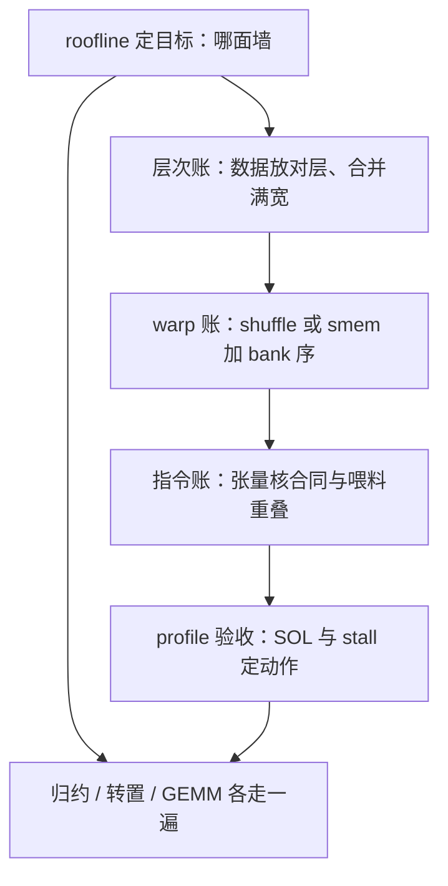
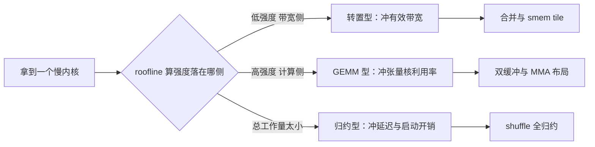

# GPU 编程案例与收束

十课下来能带走的不是一堆内核技巧，而是一张账单模板：强度定目标，层次放数据，warp 排人，指令喂阵列，profile 验收。

<footer>—— 据 Kirk &amp; Hwu, Programming Massively Parallel Processors 与本课程各课整理</footer>

[上一课](/cs/gpu-rocm-comparison)用 ROCm 的对照把厂商细节与并行本质分开，本课程到此收束。本课做两件事：把十个课收成一张能带走的清单，再用三个经典内核把清单各走一遍——归约、转置、GEMM；每一步都能指回讲它的那课，学过的合同在这里结算。

## 问题

学完一课程的常见下场是散点化：知道 bank 冲突、知道合并访问、知道碎片合同，但面对一个慢内核，不知道先动哪一处。优化顺序错了，代价不只是时间：在没有冲突的地方修冲突、在没到屋顶的墙上刷百分比，往往把代码改复杂还变慢。收束课的缺口因此是把决策顺序钉死成一条链，并确认这条链在三个不同形状的内核上都不打弯。

## 方法

决策链五步，也是三个案例的走法。第一步用 [roofline](/cs/roofline-model) 定目标：算出算强度，知道自己在带宽侧还是计算侧、天花板在哪。第二步层次账：数据钉在哪层、全局访问是否合并满宽（第二课）。第三步 warp 账：warp 内交换走 shuffle、块内交换走 smem 并算 bank 序（第三、四课）。第四步指令账：矩阵乘上张量核、布局守碎片合同、喂料与计算重叠（第五课）。第五步 profile 验收：SOL 定墙、stall 定动作（第七课），出错了按调试课的纪律拉回证据。

案例走查只用这五步。归约：目标在延迟侧（工作太少，谈带宽无意义），warp 内 butterfly 五步全归约，跨 warp 才付 smem 与屏障的税——启动开销占比大到「算法」几乎不存在的地步，这正是它常被写成单 block 教学例的原因。转置：两面都是访存，目标是有效带宽逼近 HBM 峰值；smem tile 一次解决两侧的合并（读按行进、写按列出），行宽 33 或 swizzle 消掉读侧冲突。GEMM：目标在计算墙，张量核利用率是验收线；tile 加双缓冲加 MMA 加 swizzle，[CUTLASS 的分层](/cs/gpu-cutlass-intuition)就是这条链的库化——标准形状用库，改融合才下到层里改。

## 机制

清单为什么能收得拢：硬件不变量少。warp 是调度原子（第一课），层次是带宽梯度（第二课），专用单元按布局合同喂料（第五课）——这三条跨代稳定，账本结构就跨代有效；ROCm 对照检验过的正是这份稳定性：参数全换、结构照读。三个案例恰好各自占稳一个不变量的极端：归约把调度原子的开销暴露到最大，转置把带宽梯度的税表列全，GEMM 把布局合同兑现成 TFLOPS——极端点都走通了，中间形态只是插值。

验收线各案例不同这件事要单独强调：归约看延迟、转置看有效带宽占比、GEMM 看张量核利用率。验收指标选错，优化就会指向错误的墙——这也是本课程反复出现的错法：账没算错，账的科目选错了。

直觉类比：优化内核像体检看病——roofline 是第一步的验血分诊，告诉你病在「算得慢」（计算墙）还是「搬数慢」（带宽墙）；后面四步是对症下药。初学者容易一上来就乱开药（比如无脑加 `__ldg`、换指令），病根没找到，药全白吃。

术语翻译：SOL（speed of light）不是物理学光速，而是 profiler 给出的「该内核在当前硬件上理论上限的百分比」——SOL Memory 87% 表示内存子系统已跑到理论峰值的 87%，再想快就得换算法减少搬运，而不是继续抠指令。

## 边界

本课程没有覆盖的地带照例交代：多 GPU 与集合通信、图形管线与光追、功耗与嵌入式部署，都另有课程与文献；把并行结构抽象回算法模型（工作量的划分、同步的语义、可扩展性的界限）是下一门课程的题目——本课程交出的是那层抽象脚下的硬件事实。最后的出处口径：执行模型与内建函数按 NVIDIA CUDA C++ Programming Guide 与 PTX ISA；层次与经典案例按 Kirk & Hwu 的 *Programming Massively Parallel Processors* 教材口径；张量核按架构白皮书；工具按 Nsight 与 compute-sanitizer 文档；每课的具体引用随课标注。

三个案例的验收线数字感：好的 warp 归约在微秒量级、启动开销占大头；好的转置能到 HBM 峰值的七八成；好的 fp16 GEMM 在大形状下逼近张量核峰值的八成以上、小形状急剧掉——用同一个百分比去验收三个案例，是最常见的收束失败。

## 小结

- 决策链五步固定：roofline 定目标、层次账、warp 账、指令账、profile 验收；顺序就是优先级。
- 归约、转置、GEMM 各占一个硬件不变量的极端：调度原子、带宽梯度、布局合同。
- 验收线随内核类型走：延迟、有效带宽占比、张量核利用率——科目选错等于墙找错。
- 三条硬件不变量跨代稳定，账本结构可移植；参数是专名，ROCm 对照是检验。
- 多卡、图形、功耗与算法模型层是本课程的边界，硬件事实在此交棒。
- 出处：NVIDIA CUDA C++ Programming Guide 与 PTX ISA；Kirk & Hwu, *Programming Massively Parallel Processors*；各课随课标注。
