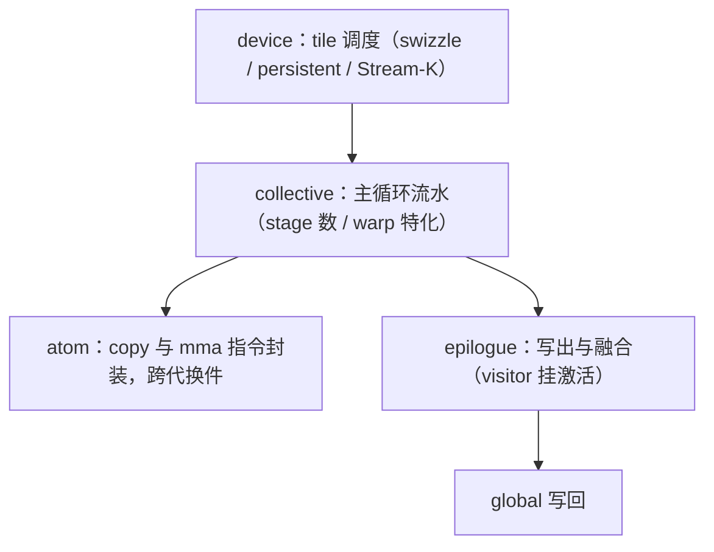
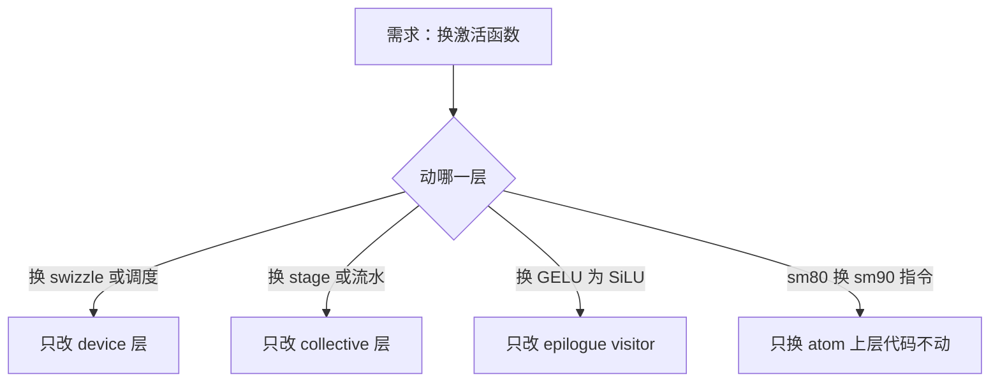

# CUTLASS 的结构直觉

CUTLASS 把 GEMM 拆成四层可换件——调度、流水、收尾、指令；分层的判据只有一条：换这一层时，别的层不用动。

<footer>—— 据 NVIDIA CUTLASS 文档整理</footer>

[上一课](/cs/gpu-tensorcore-programming)把 MMA 的三层抽象与喂料模板摆出；从指令到一个生产级 GEMM 还差两件事：tile 怎么调度、流水怎么叠。大模型栏的 [CUTLASS 层次](/llm/cutlass)与 [cuTeDSL / CUTLASS 3](/llm/cutlass3-cute)做过层次走读与 API 细读，[ThunderKittens](/llm/thunderkittens) 给了另一套抽象的对照。本课写结构直觉：这套分层为什么成立、每层交换什么、改需求时该在哪层动手。

## 问题

生产级 GEMM 叠着几组相互正交的决策：tile 的二维排布（防 L2 抖动、均衡负载）、主循环的 stage 数与缓冲、warp 任务的划分、epilogue 的融合（激活、偏置、量化都挂在这）、以及跨代指令的选择。逐个手写是组合爆炸：五个维度各三档就是上百个内核。CUTLASS 的回答不是「更聪明的代码生成」，而是先回答一个结构问题：这些决策里哪些正交到可以独立替换？分层分错了的代价是可见的——把 epilogue 写死在主循环里的库，每加一种激活就要复制整个 GEMM。

## 方法

四层从外到内，每层认领一组决策。device 层认调度：tile 到 block 的映射——线性序加 swizzle 换 L2 局部性；persistent 与 Stream-K 换负载均衡，把「一个 block 做一个 tile」改成「一个 block 吃完一批 tile」或「把残余的 k 段拆给闲下来的 block」（[persistent kernel 课](/llm/persistent-kernel)给过前者的机制）。collective 层认主循环：global 到 smem 的多 stage 流水加 MMA，合同是 smem 容量除以 stage 数，[软件流水课](/llm/sw-pipeline-buffer)的账在这里兑现；Hopper 的 warp 特化（生产者拷贝、消费者 MMA）是这一层在 sm90 上的形态。epilogue 层认写出：smem 到 global 的布局变换与逐元素融合，激活函数挂在这层的 visitor 上。atom 层认指令：copy atom 与 mma atom 是上一课三层抽象的封装，跨代换件——sm80 的 `cp.async` 加 `mma.sync` 换成 sm90 的 TMA 加 wgmma，collective 之上的代码不动。

## 机制

模板分层为什么可行：所有决策在编译期实例化，层与层只交换布局与坐标，不交换运行时对象——没有虚调用，分层不付间接税。层间语言是 CuTe 的 layout 代数：`shape : stride` 的张量加 compose、slice 两个操作，epilogue 拿到的不是裸指针而是「带布局的视图」，所以融合一个激活不需要知道主循环的 swizzle 细节。跨代复制配置不成立的原因也在这层结构里：atom 换代意味着布局合同变了（上一课的 8/4/4 变成 wgmma 的 smem 操作数），swizzle 模式与 stage 数的合法解集随之变——参数表是「某一代硬件 + 某一算法」的解，不是普适常数，[CUTLASS 层次课](/llm/cutlass)的结论「架构是模板的一部分」说的就是这个。

数字实例：collective 层的 stage 合同是「smem 容量 ÷ stage 数 = 单个 stage 的字节数」。sm80 一块 smem 约 164 KB：tile 尺寸 A+B 各 128×32 的 fp16 时每 stage 约 16 KB，理论能开 8 stage；换成 128×64 就要砍半。改 tile 尺寸后必须重算 stage 数，否则编译期直接报 smem 溢出——这就是「换这层、别层要复核合同」的具体样子。

常见误区：初学者容易以为「分层=运行时多态=变慢」。CUTLASS 的分层全部在编译期展开：换 epilogue 的激活函数是换模板参数，生成的代码里连函数指针都没有，更没有虚表查找。慢的是「运行时再决定」，不是「代码组织上分层」。

## 边界

API 走读与实例代码归大模型栏那两课，本课只给「在哪层换什么」的地图。CUTLASS 不是唯一抽象：ThunderKittens 用更小的原语面换更陡的学习曲线，Triton 把 tile 层交给编译器（[Triton 写注意力核](/llm/triton-attention-kernel)）；抽象的选择标准是你要改哪一层。autotuning 的方法（扫 stage 与 tile 的网格、记录配置）在 profiling 课之后另有归宿，本课不展开。也别把 CUTLASS 当默认答案：标准形状下 [cuBLAS](/llm/cublas-cudnn) 先行，CUTLASS 的价值在可改与库外融合。

threadblock swizzle 的最小示例：把 tile 的线性序按每 8 列一组蛇形重排，相邻 block 同时算的 tile 在空间上聚簇，L2 命中率即可观上升——device 层一行的改动，主循环一行不动；能指出改动属于哪层，就是这套分层的用法。

## 小结

- 分层判据是「换这层、别层不动」：调度在 device、流水在 collective、收尾在 epilogue、指令在 atom。
- 层间语言是布局与坐标（CuTe 的 layout 代数），不是指针与循环边界。
- 编译期实例化让分层不付间接税；运行时没有虚调用。
- 跨代复制参数表不成立：atom 换代即布局合同换代，合法解集随之变。
- 选抽象先问要改哪层：库兜底走 cuBLAS，改融合走 CUTLASS，改 tile 语义走 Triton 或更小的原语面。
- 出处：NVIDIA CUTLASS 与 CUTLASS 3.x / CuTe 文档。
